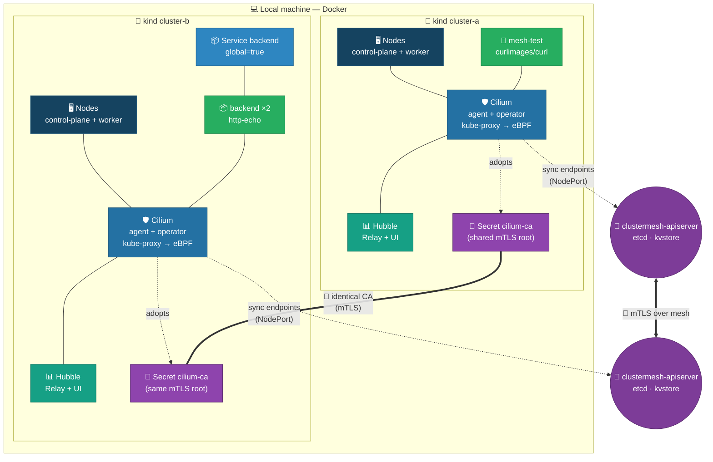
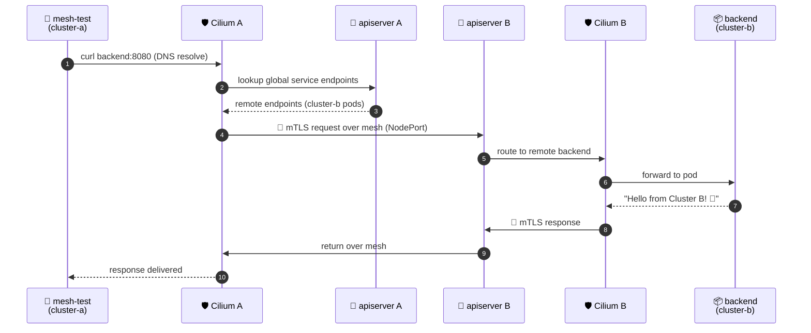

# build-clustermesh.sh — Cilium ClusterMesh Lab on kind

A single, self-contained Bash script that builds a working **Cilium ClusterMesh**
between two local [kind](https://kind.sigs.k8s.io/) clusters and proves it with an
end-to-end cross-cluster request.

```bash
./build-clustermesh.sh
```

When it finishes you get two connected clusters, a global `backend` service shared
across them, and a verified `Hello from Cluster B! 🎉` response served from
`cluster-b` to a pod in `cluster-a`.

---

## What it does (phases)

| Phase | Action | Result |
|-------|--------|--------|
| 0 | Prerequisite check | Confirms `kind`, `kubectl`, `docker`, `cilium`, `openssl` are present |
| 1 | Create clusters | `cluster-a` + `cluster-b` (eBPF kube-proxy replacement, no default CNI) |
| 2 | Shared CA | Pushes the local `ca.crt`/`ca.key` into both clusters as the `cilium-ca` secret (mTLS trust root) |
| 3 | Install Cilium | Full feature set on both: Hubble Relay + UI, metrics, `clustermesh.enableEndpointSliceSynchronization`, mTLS via shared CA |
| 4 | Enable mesh | `clustermesh enable --service-type NodePort` on both, waits for the apiserver |
| 5 | Connect | `clustermesh connect` links the two clusters (mTLS over the shared CA) |
| 6 | Global service | Deploys `backend` in `cluster-b` and the identical Service in `cluster-a`, annotated `service.cilium.io/global=true` |
| 7 | Test | Runs a `curlimages/curl` pod in `cluster-a`, resolves `backend` via DNS and curls it across the mesh; prints ClusterMesh status + remote nodes |

The temporary test pod is removed automatically on exit (via `trap`).

---

## Topology diagram

### Component diagram (what the script deploys)



**Legend:** 🖥️ nodes · 🛡️ Cilium CNI/Proxy · 📊 Hubble observability · 🔑 shared
trust root (CA) · 📦 workload · 🌉 ClusterMesh control plane (etcd + kvstore).

---

### Request flow (cross-cluster test)



**Flow in one sentence:** a pod in `cluster-a` asks for `backend`; Cilium resolves it
to `cluster-b`'s pods, signs and encrypts the request with mTLS (shared CA), sends it
across the local Docker network to `cluster-b`, where Cilium delivers it to the
`backend` pods and returns `Hello from Cluster B! 🎉`.

---

## Prerequisites

- `kind`, `kubectl`, `docker`, `cilium` CLI, `openssl`
- A `ca.crt` + `ca.key` in this directory (the script generates a 10-year CA if missing)
- The manifest files alongside the script: `kind-bpf-a.yaml`, `kind-bpf-b.yaml`,
  `deploy-backend.yaml`, `deploy-backend-service.yaml`

> 💡 The script leaves the two clusters **running** when it finishes so you can explore
> (e.g. `cilium hubble ui --context kind-cluster-a`). Delete them with
> `kind get clusters | xargs -I {} kind delete cluster --name {}`.

---

## Key implementation notes

- **kube-proxy replacement (eBPF):** the kind configs set `disableDefaultCNI: true`
  and `kubeProxyMode: "none"`, so Cilium fully owns service load-balancing and
  cross-cluster routing.
- **Shared CA = mTLS:** both clusters trust the *same* `cilium-ca` secret, so the
  ClusterMesh control plane is mutually authenticated and encrypted. The secret is
  labelled `app.kubernetes.io/managed-by=Helm` so the Cilium Helm install can adopt it.
- **Global service annotation:** the correct key is
  `service.cilium.io/global=true`. Cilium only syncs **endpoints** across the mesh —
  it does **not** create the `Service` object remotely — so the identical `backend`
  Service must exist in **both** clusters (hence `deploy-backend-service.yaml`).
- **`clustermesh.enableEndpointSliceSynchronization=true`** is required so the remote
  endpoints are merged into the local `backend` Service.
- **Test pod choice:** `curlimages/curl` is used instead of `ubuntu-debug.yaml`
  because the latter installs tools via `apt-get`, which needs pod internet egress.

---

## What gets created

| Object | Cluster | Purpose |
|--------|---------|---------|
| `cluster-a` / `cluster-b` | Docker | The two kind clusters |
| `cilium-ca` secret | both | Shared mTLS trust root |
| Cilium + Hubble | both | CNI, observability, metrics |
| `clustermesh-apiserver` (NodePort) | both | Mesh control plane + etcd |
| `backend` Deployment + Service (`global`) | cluster-b | The shared application |
| `backend` Service (`global`) | cluster-a | Remote endpoint merge target |
| `mesh-test` pod (temp) | cluster-a | Runs the cross-cluster curl, then deleted |
