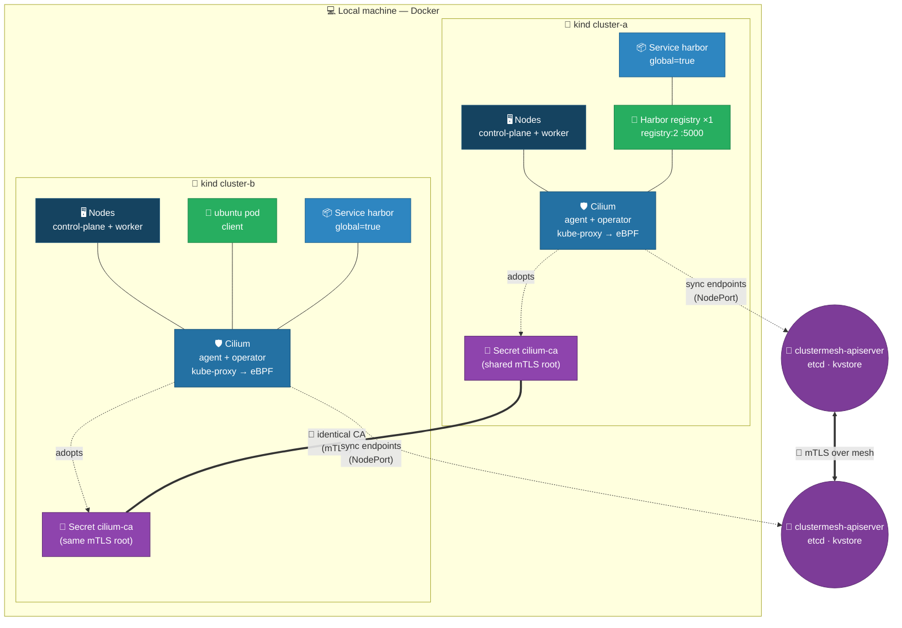
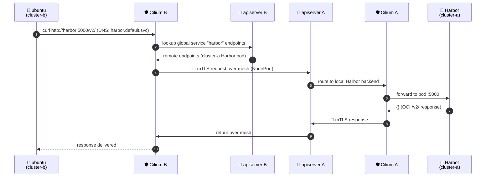

# Harbor on cluster-a, reachable from cluster-b via ClusterMesh

This walkthrough deploys **Harbor** (the registry/UI) on `cluster-a`, shares it as a
**Cilium Global Service**, and reaches it from an **Ubuntu** pod on `cluster-b` using
the local DNS name `harbor`. It is the mirror image of
[`README-build-clustermesh.md`](./README-build-clustermesh.md) — here the *server* lives
in A and the *client* lives in B.

> Assumes the two clusters are already built and the mesh is connected (e.g. by running
> `./build-clustermesh.sh` first, or follow that README's phases 1–5). The mesh must be
> up before a global service can sync.

---

## What gets deployed

| Object | Cluster | Purpose |
|--------|---------|---------|
| `harbor` Deployment + Service (`global`) | cluster-a | The shared Harbor registry (`registry:2` on :5000) |
| `harbor` Service (`global`) | cluster-b | Remote endpoint merge target — `harbor` resolves locally |
| `harbor-client` pod (`curlimages/curl`) | cluster-b | Client that reaches `harbor` via cluster DNS |

---

## Topology diagram

### Component diagram



**Legend:** 🖥️ nodes · 🛡️ Cilium CNI/Proxy · 🔑 shared trust root (CA) · 📦 workload /
Service · 🚢 Harbor · 🐧 Ubuntu client · 🌉 ClusterMesh control plane.

---

### Request flow (Ubuntu in B → Harbor in A)



---

## Steps

### 1. Deploy Harbor on cluster-a (with the global annotation)

```bash
kubectl apply --context kind-cluster-a -f deploy-harbor.yaml
kubectl wait --context kind-cluster-a --for=condition=Available deployment/harbor --timeout=180s
```

### 2. Create the SAME Service on cluster-b

Cilium only syncs **endpoints** across the mesh, not the Service object, so the
identical `harbor` Service must exist in cluster-b too:

```bash
kubectl apply --context kind-cluster-b -f deploy-harbor-service.yaml
```

Note: in the **consumer** cluster (B) the `Endpoints` object for `harbor` legitimately
stays `<none>` — Cilium programs the remote Harbor endpoints into its own datapath
rather than the Kubernetes Endpoints API. The real proof is the DNS lookup + HTTP
request below, not `kubectl get endpoints`.

### 3. Run a curl client on cluster-b

Use the prebuilt `curlimages/curl` pod (no internet egress needed — `ubuntu-debug.yaml`
relies on `apt-get` to install curl and fails when pods have no outbound internet):

```bash
kubectl apply --context kind-cluster-b -f deploy-harbor-client.yaml
kubectl wait --context kind-cluster-b --for=condition=Ready pod/harbor-client --timeout=120s
```

### 4. Reach Harbor via local DNS from cluster-b

The OCI registry serves its v2 API on port `5000`. From a pod **inside** cluster-b the
`harbor` name resolves locally and is routed across the mesh to cluster-a:

```bash
kubectl exec --context kind-cluster-b harbor-client -- \
  curl -s --max-time 20 http://harbor:5000/v2/
```

Expected: `{}` — the standard OCI distribution `/v2/` response, served from the
Harbor registry pod running in **cluster-a** over the mesh.

Other checks:

```bash
# DNS resolution (resolves to a cluster-b in-cluster VIP)
kubectl exec --context kind-cluster-b harbor-client -- \
  nslookup harbor.default.svc.cluster.local

# Raw HTTP status
kubectl exec --context kind-cluster-b harbor-client -- \
  curl -s -o /dev/null -w "%{http_code}\n" --max-time 20 http://harbor:5000/v2/
```

---

## Accessing Harbor from outside the clusters (port-forward)

There are two different access paths and they behave differently because of how Cilium
syncs a Global Service:

| You want to… | Works? | How |
|--------------|--------|-----|
| Reach `harbor` **from a pod in cluster-b** | ✅ | `curl http://harbor:5000/v2/` (step 4 above) — Cilium eBPF routes to cluster-a |
| `kubectl port-forward` the **service in cluster-a** → laptop | ✅ | `kubectl port-forward --context kind-cluster-a svc/harbor 5000:5000` then `curl localhost:5000/v2/` |
| `kubectl port-forward` the **service in cluster-b** → laptop | ❌ | The `harbor` Service in B has **no local endpoints** (its backends live in A, programmed by Cilium's eBPF datapath, not kube-proxy). `port-forward` selects a local endpoint and fails with `connection refused`. |

> ⚠️ **Why port-forward on cluster-b fails:** a Global Service only syncs *endpoints*,
> not the Service or its local EndpointObjects. In cluster-b `kubectl get endpoints harbor`
> shows `<none>`, so `kubectl port-forward svc/harbor` (cluster-b) has nothing local to
> forward to. To reach Harbor from your laptop, port-forward in **cluster-a** (where the
> pod actually runs), or use a pod inside cluster-b.

### Laptop access via cluster-a (recommended)

```bash
# Terminal 1 — keep this running in the background
kubectl port-forward --context kind-cluster-a svc/harbor 5000:5000

# Terminal 2
curl -s http://localhost:5000/v2/      # -> {}
```

### Laptop access via a debug pod in cluster-b

If you specifically need to exercise the cluster-b name from your laptop, port-forward
the **curl client pod** in B (not the service) and exec into it:

```bash
kubectl exec -it --context kind-cluster-b harbor-client -- \
  curl -s --max-time 20 http://harbor:5000/v2/     # -> {}
```

---

## Why it works

- **Shared CA = mTLS:** both clusters trust the same `cilium-ca` secret, so the
  ClusterMesh control plane is mutually authenticated and encrypted.
- **Global service annotation:** `service.cilium.io/global=true` (correct key — the
  deprecated `cilium.io/global-service` is silently ignored by Cilium 1.19).
- **Endpoint sync:** `clustermesh.enableEndpointSliceSynchronization=true` merges
  cluster-a's Harbor endpoints into cluster-b's `harbor` Service, so `harbor` resolves
  and load-balances to the remote pods.
- **Local DNS:** CoreDNS in cluster-b answers `harbor.default.svc.cluster.local` using
  the synced endpoints — the client uses a plain in-cluster name, no external DNS needed.

---

## Cleanup

```bash
kubectl delete pod ubuntu-debug harbor-client --context kind-cluster-b 2>/dev/null
kubectl delete -f deploy-harbor.yaml --context kind-cluster-a 2>/dev/null
kubectl delete -f deploy-harbor-service.yaml --context kind-cluster-b 2>/dev/null
```
