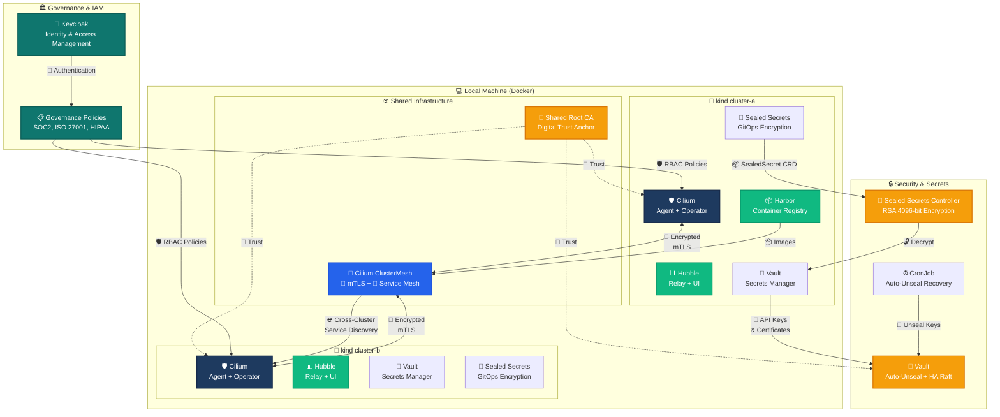
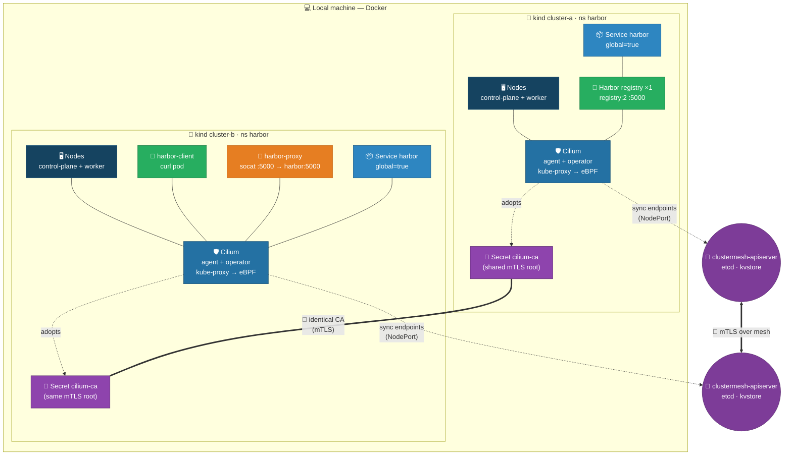
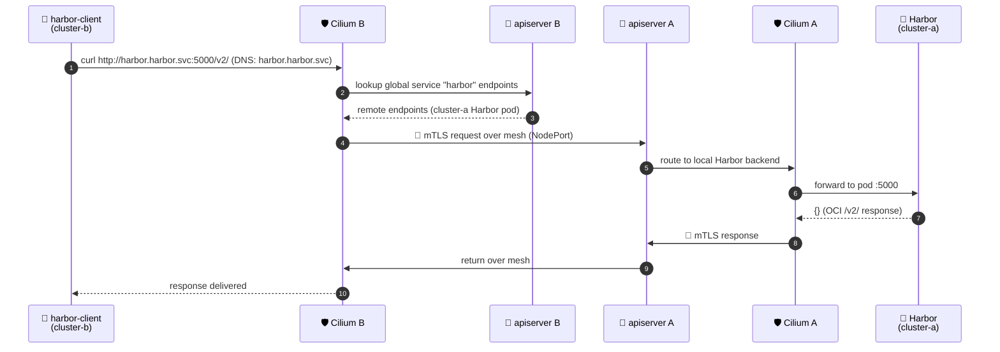
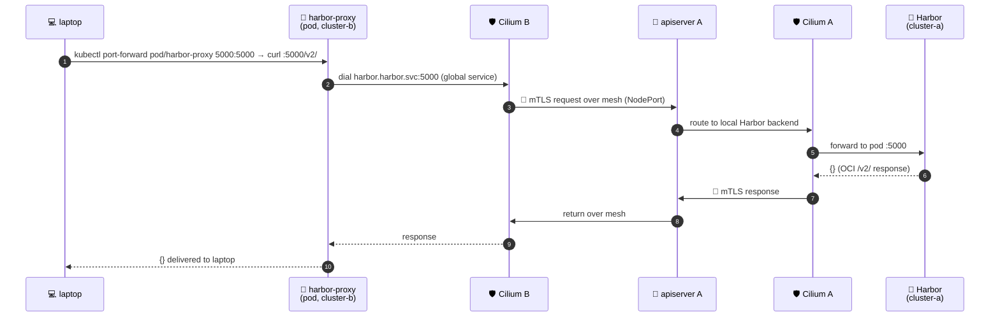

# Harbor on cluster-a, reachable from cluster-b via ClusterMesh

This walkthrough deploys **Harbor** (the registry/UI) on `cluster-a`, shares it as a
**Cilium Global Service**, and reaches it from an **Ubuntu** pod on `cluster-b` using
the local DNS name `harbor`. It is the mirror image of
[`README-build-clustermesh.md`](./README-build-clustermesh.md) — here the *server* lives
in A and the *client* lives in B.

> Assumes the two clusters are already built and the mesh is connected (e.g. by running
> `./build-clustermesh.sh` first, or follow that README's phases 1–5). The mesh must be
> up before a global service can sync.

---

## 🗺️ Infrastructure Architecture Overview



---

## What gets deployed

| Object | Cluster | Namespace | Purpose |
|--------|---------|-----------|---------|
| `harbor` Deployment + Service (`global`) | cluster-a | `harbor` | The shared Harbor registry (`registry:2` on :5000) |
| `harbor` Service (`global`) | cluster-b | `harbor` | Remote endpoint merge target — `harbor` resolves locally |
| `harbor-client` pod (`curlimages/curl`) | cluster-b | `harbor` | Client that reaches `harbor` via cluster DNS |
| `harbor-proxy` pod (`alpine/socat`) | cluster-b | `harbor` | Local TCP proxy so `kubectl port-forward` from cluster-b reaches Harbor over the mesh |

---

## Topology diagram

### Component diagram



**Legend:** 🖥️ nodes · 🛡️ Cilium CNI/Proxy · 🔑 shared trust root (CA) · 📦 workload /
Service · 🚢 Harbor · 🐧 curl client · 🔀 socat proxy (for port-forward) · 🌉 ClusterMesh
control plane.

---

### Request flow (curl in B → Harbor in A)



### Request flow (laptop port-forward via proxy in B → Harbor in A)

This is the path that lets you `kubectl port-forward` from cluster-b and reach the Harbor
UI over the mesh (the global Service itself cannot be port-forwarded — see below).



---

## Steps

### 1. Deploy Harbor on cluster-a (with the global annotation)

```bash
kubectl apply --context kind-cluster-a -f deploy-harbor.yaml
kubectl wait --context kind-cluster-a --for=condition=Available deployment/harbor --timeout=180s
```

### 2. Create the SAME Service on cluster-b

Cilium only syncs **endpoints** across the mesh, not the Service object, so the
identical `harbor` Service must exist in cluster-b too:

```bash
kubectl apply --context kind-cluster-b -f deploy-harbor-service.yaml
```

Note: in the **consumer** cluster (B) the `Endpoints` object for `harbor` legitimately
stays `<none>` — Cilium programs the remote Harbor endpoints into its own datapath
rather than the Kubernetes Endpoints API. The real proof is the DNS lookup + HTTP
request below, not `kubectl get endpoints`.

### 3. Run a curl client on cluster-b

Use the prebuilt `curlimages/curl` pod (no internet egress needed — `ubuntu-debug.yaml`
relies on `apt-get` to install curl and fails when pods have no outbound internet):

```bash
kubectl apply --context kind-cluster-b -f deploy-harbor-client.yaml
kubectl wait --context kind-cluster-b --for=condition=Ready pod/harbor-client --timeout=120s
```

### 4. Reach Harbor via local DNS from cluster-b

The OCI registry serves its v2 API on port `5000`. From a pod **inside** cluster-b the
`harbor` name (in the `harbor` namespace) resolves locally and is routed across the mesh
to cluster-a:

```bash
kubectl exec --context kind-cluster-b -n harbor harbor-client -- \
  curl -s --max-time 20 http://harbor.harbor.svc:5000/v2/
```

Expected: `{}` — the standard OCI distribution `/v2/` response, served from the
Harbor registry pod running in **cluster-a** over the mesh.

Other checks:

```bash
# DNS resolution (resolves to a cluster-b in-cluster VIP)
kubectl exec --context kind-cluster-b -n harbor harbor-client -- \
  nslookup harbor.harbor.svc.cluster.local

# Raw HTTP status
kubectl exec --context kind-cluster-b -n harbor harbor-client -- \
  curl -s -o /dev/null -w "%{http_code}\n" --max-time 20 http://harbor.harbor.svc:5000/v2/
```

### 5. Port-forward Harbor to your laptop from cluster-b

`kubectl port-forward svc/harbor` does NOT work on cluster-b (no local endpoints — see
the port-forward section below). Deploy the local `socat` proxy pod and port-forward to
*that* pod instead:

```bash
kubectl apply --context kind-cluster-b -f deploy-harbor-proxy.yaml
kubectl wait --context kind-cluster-b -n harbor --for=condition=Ready pod/harbor-proxy --timeout=120s

# Terminal 1 — keep running
kubectl port-forward --context kind-cluster-b -n harbor pod/harbor-proxy 5000:5000

# Terminal 2
curl -s http://localhost:5000/v2/      # -> {} (Harbor UI/API via the mesh)
```

---

## Accessing Harbor from your laptop (port-forward)

The goal — "port-forward on cluster-b and reach the Harbor UI over the mesh" — is met
with a small local **proxy pod** in cluster-b. Here is why, and the working recipe.

### Why `kubectl port-forward svc/harbor` fails on cluster-b

A Cilium Global Service syncs *endpoints* into the consumer cluster's **eBPF datapath**
only. The Kubernetes `Endpoints`/`EndpointSlice` object for `harbor` in cluster-b stays
empty (`kubectl get endpoints harbor -n harbor` shows `<none>`). `kubectl port-forward`
selects a local endpoint through kube-proxy/kubelet and, finding none, fails with
`connection refused`. (Verified: even the known-good `backend` global service shows no
mirrored EndpointSlice in the consumer cluster.) So the **Service** itself cannot be
port-forwarded from cluster-b.

### Working recipe: port-forward the local proxy pod on cluster-b

`deploy-harbor-proxy.yaml` runs a `socat` TCP proxy pod **inside cluster-b** that dials
the global `harbor` name (resolved across the mesh to the Harbor pod in cluster-a) and
re-exposes it on `:5000`. Because the pod is local to cluster-b, port-forwarding *to the
pod* works — and the traffic still reaches Harbor in cluster-a over the mesh.

```bash
# 1. Deploy the proxy pod in cluster-b (harbor namespace)
kubectl apply --context kind-cluster-b -f deploy-harbor-proxy.yaml
kubectl wait --context kind-cluster-b -n harbor --for=condition=Ready pod/harbor-proxy --timeout=120s

# 2. Port-forward the PROXY POD (not the Service) from cluster-b
kubectl port-forward --context kind-cluster-b -n harbor pod/harbor-proxy 5000:5000
```

In another terminal:

```bash
curl -s http://localhost:5000/v2/      # -> {}  (Harbor registry API, served from cluster-a)
```

Data path: `laptop → kubelet port-forward → harbor-proxy pod (cluster-b) →
harbor.default.svc (global, Cilium eBPF) → Harbor pod (cluster-a)`.

### Alternative: port-forward the Service on cluster-a

If reaching Harbor directly from where it runs is acceptable, port-forward the Service in
the cluster that actually hosts the pod:

```bash
kubectl port-forward --context kind-cluster-a -n harbor svc/harbor 5000:5000
curl -s http://localhost:5000/v2/      # -> {}
```

---

## Why it works

- **Shared CA = mTLS:** both clusters trust the same `cilium-ca` secret, so the
  ClusterMesh control plane is mutually authenticated and encrypted.
- **Global service annotation:** `service.cilium.io/global=true` (correct key — the
  deprecated `cilium.io/global-service` is silently ignored by Cilium 1.19).
- **Endpoint sync into the datapath:** Cilium programs cluster-a's Harbor endpoints into
  cluster-b's eBPF socket LB, so `harbor` resolves and load-balances to the remote pods
  from any pod in cluster-b (and from the proxy pod used for port-forward).
- **Local DNS:** CoreDNS in cluster-b answers `harbor.harbor.svc.cluster.local` using the
  synced endpoints — the client uses a plain in-cluster name, no external DNS needed.
- **harbor namespace:** Deployment, Service (both clusters) and the client/proxy pods all
  live in the dedicated `harbor` namespace.

---

## Cleanup

```bash
kubectl delete pod harbor-client harbor-proxy --context kind-cluster-b -n harbor 2>/dev/null
kubectl delete -f deploy-harbor.yaml --context kind-cluster-a 2>/dev/null
kubectl delete -f deploy-harbor-service.yaml --context kind-cluster-b 2>/dev/null
kubectl delete -f deploy-harbor-proxy.yaml --context kind-cluster-b 2>/dev/null
```
