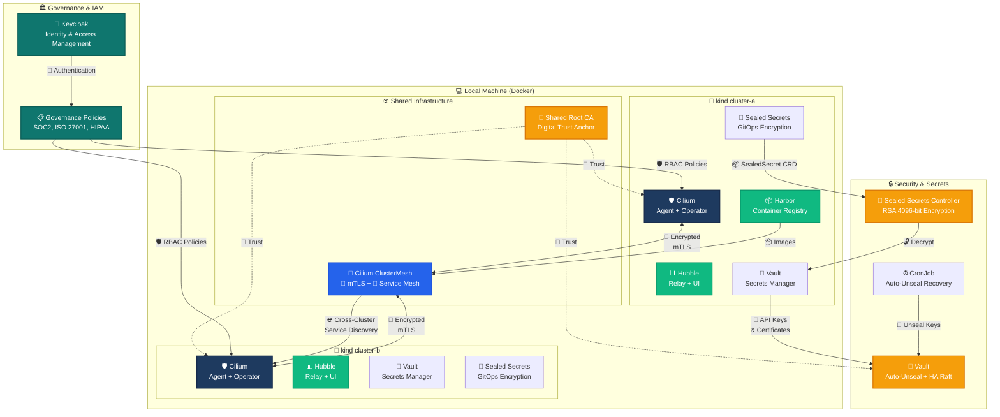

# Governance

This directory contains policies, compliance frameworks, and operational guidelines for the infrastructure.

---

## 🗺️ Infrastructure Architecture Overview

---

## Topics Covered

- Security policies and access control
- Compliance standards (SOC2, ISO 27001, HIPAA, etc.)
- Change management and approval workflows
- Audit logging and monitoring requirements
- Incident response procedures
- Infrastructure-as-Code review processes
- Identity and Access Management (IAM) — see [Keycloak deployment](./keycloak/README.md)

## Related Resources

- [./keycloak](./keycloak/README.md) — IAM deployment with Kustomize + config-as-code
- [./secret-management](../secret-management/README.md) — secrets handling governed by these policies
