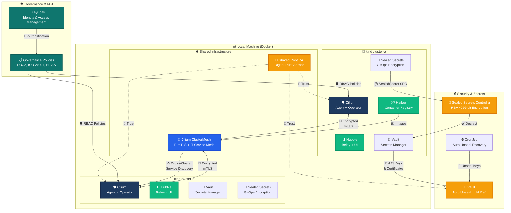

# Keycloak Deployment — Kustomize + Config-as-Code

This directory defines a **declarative Keycloak deployment** using Kustomize, with all
Identity and Access Management (IAM) configuration — realms, users, roles, groups,
and policies — managed as code via Keycloak's realm import feature.

---

## 🗺️ Infrastructure Architecture Overview



---

## Structure

```
keycloak/
├── base/                          # Shared base resources
│   ├── kustomization.yaml         # Wires all resources
│   ├── deployment.yaml            # Keycloak Deployment (Quarkus distro)
│   ├── service.yaml               # ClusterIP Service
│   ├── configmap.yaml             # Keycloak configuration (env vars)
│   └── realm-import.yaml          # Realm definition with users/roles/groups/policies
├── overlays/
│   ├── dev/                       # Dev overlay (single replica, dev DB)
│   │   └── kustomization.yaml
│   └── prod/                      # Production overlay (HA, TLS, PostgreSQL)
│       └── kustomization.yaml
└── README.md
```

## Usage

```bash
# Deploy to dev
kustomize build governance/keycloak/overlays/dev | kubectl apply -f -

# Deploy to production
kustomize build governance/keycloak/overlays/prod | kubectl apply -f -
```

## Configuration as Code

All realm configuration lives in `base/realm-import.yaml`. This includes:

- **Realm** — master realm settings, themes, brute-force protection
- **Users** — user accounts with credentials, enabled/disabled state
- **Roles** — realm-level and client-level roles
- **Groups** — group hierarchy with assigned roles
- **Policies** — Keycloak Authorization Services policies (role-based, JS-based, etc.)

After initial deployment, the `--import-realm` CLI argument triggers Keycloak
to import realm JSON files from `/opt/keycloak/data/import` on startup. Subsequent
changes must be applied via the Keycloak Admin API or by re-deploying with updated
ConfigMap contents.

## Related Governance Policies

See [../README.md](../README.md) for the overarching governance framework,
including security policies, access control standards, and IaC review processes.
