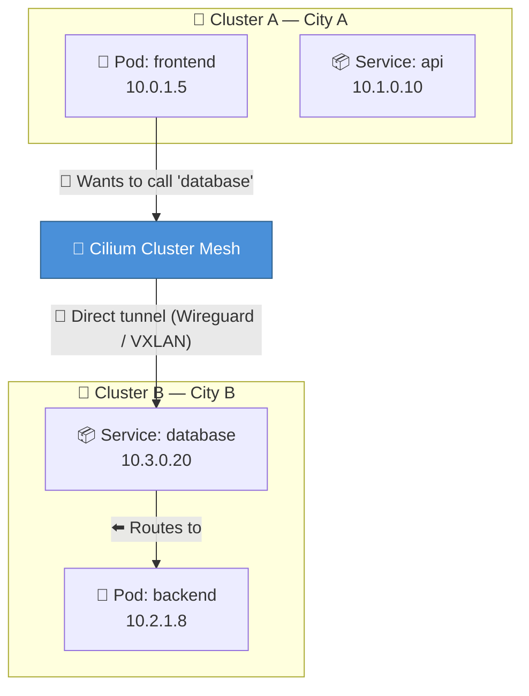
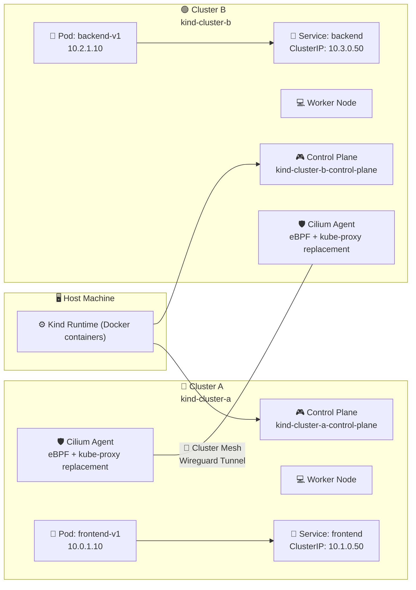
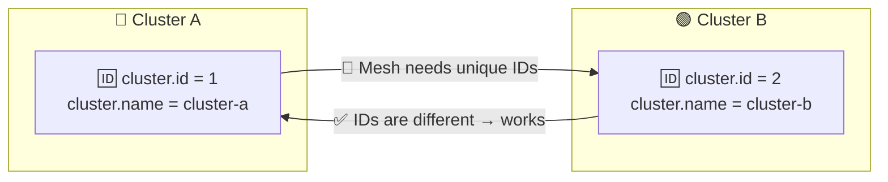
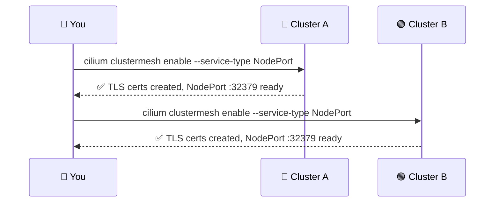
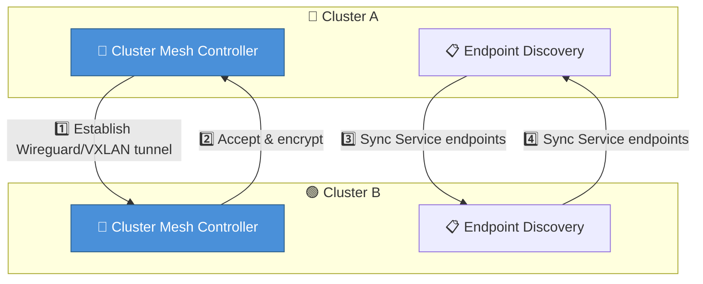
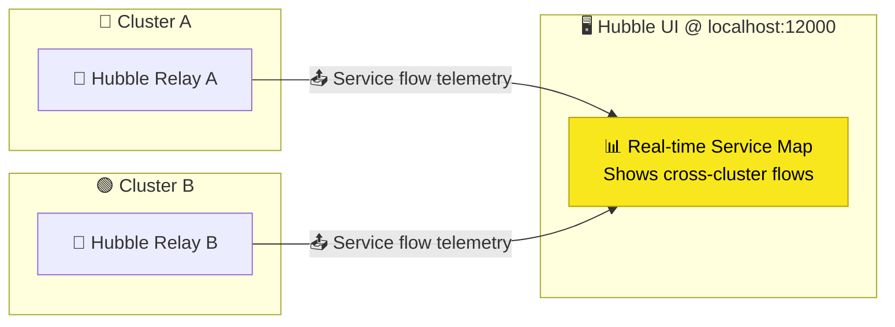
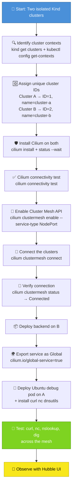

# 🚀 Cilium Cluster Mesh with Kind

> *This guide walks you through connecting two Kubernetes clusters so a Service in Cluster A can talk to a Service in Cluster B, using Cilium Cluster Mesh — with every single step covered, verified, and testable.*

---

## 🧠 What is Cilium Cluster Mesh? (For non-technical people)

Imagine you have **two separate cities** (clusters), each with their own buildings (pods) and roads (network). Normally, nothing can cross between cities — a building in City A cannot call a building in City B.

🌉 **Cilium Cluster Mesh builds a bridge between the cities.** Now a building in City A can reach a building in City B directly, using the same local address, without going through the internet or complex VPNs.



---

## 🏗️ High-Level Architecture



---

## 📋 Prerequisites

| Tool | Purpose | Check Command |
|------|---------|---------------|
| 🐳 **Docker** | Runs Kind nodes | `docker --version` |
| ⚡ **Kind** | Local K8s clusters | `kind --version` |
| ☸️ **kubectl** | Talk to clusters | `kubectl --version` |
| 🛡️ **Cilium CLI** | Install & manage Cilium | `cilium --version` |

---

# 👣 Complete Step-by-Step Walkthrough

## Step 0 — Full Environment Setup

### 0a. Create both Kind clusters

```bash
kind create cluster --config kind-bpf-a.yaml
kind create cluster --config kind-bpf-b.yaml
```

### 0b. Verify clusters exist

```bash
kind get clusters
```

**Expected output:**
```
cluster-a
cluster-b
```

### 0c. Identify cluster contexts in kubectl

```bash
kubectl config get-contexts
```

**Expected output (context names):**
```
kind-cluster-a
kind-cluster-b
```

### 0d. Check both clusters are fully operational

```bash
kubectl cluster-info --context kind-cluster-a
kubectl cluster-info --context kind-cluster-b
kubectl get nodes --context kind-cluster-a
kubectl get nodes --context kind-cluster-b
```

**Expected output:** Both control planes reachable, both nodes `Ready`.

### 0e. 🆔 Identify clusters — assign unique cluster IDs

Cilium Cluster Mesh requires **each cluster to have a unique ID** (1–255) and a name. These are baked into Cilium's identity-based networking. If both clusters use the default ID `1`, the mesh will not route correctly.

| Cluster | Context | Assigned ID | Assigned Name |
|---------|---------|-------------|---------------|
| 🔵 Cluster A | `kind-cluster-a` | **1** | `cluster-a` |
| 🟢 Cluster B | `kind-cluster-b` | **2** | `cluster-b` |

```bash
echo "Cluster A → ID=1  name=cluster-a"
echo "Cluster B → ID=2  name=cluster-b"
```



### 0f. Install Cilium on Cluster A (with cluster ID 1)

```bash
cilium install \
    --context kind-cluster-a \
    --set cluster.id=1 \
    --set cluster.name=cluster-a \
    --set ipam.mode=kubernetes \
    --set kubeProxyReplacement=true \
    --set securityContext.capabilities.ciliumAgent="{CHOWN,KILL,NET_ADMIN,NET_RAW,IPC_LOCK,SYS_ADMIN,SYS_RESOURCE,DAC_OVERRIDE,FOWNER,SETGID,SETUID}" \
    --set securityContext.capabilities.cleanCiliumState="{NET_ADMIN,SYS_ADMIN,SYS_RESOURCE}" \
    --set cgroup.autoMount.enabled=false \
    --set cgroup.hostRoot=/sys/fs/cgroup \
    --set gatewayAPI.enabled=true \
    --set gatewayAPI.installCRDs=true \
    --set gatewayAPI.enableAlpn=true \
    --set gatewayAPI.enableAppProtocol=true \
    --set ingressController.enabled=true \
    --set hubble.enabled=true \
    --set hubble.relay.enabled=true \
    --set hubble.ui.enabled=true
```

Wait for Cilium to be ready:

```bash
cilium status --context kind-cluster-a --wait
```

### 0g. Install Cilium on Cluster B (with cluster ID 2)

```bash
cilium install \
    --context kind-cluster-b \
    --set cluster.id=2 \
    --set cluster.name=cluster-b \
    --set ipam.mode=kubernetes \
    --set kubeProxyReplacement=true \
    --set securityContext.capabilities.ciliumAgent="{CHOWN,KILL,NET_ADMIN,NET_RAW,IPC_LOCK,SYS_ADMIN,SYS_RESOURCE,DAC_OVERRIDE,FOWNER,SETGID,SETUID}" \
    --set securityContext.capabilities.cleanCiliumState="{NET_ADMIN,SYS_ADMIN,SYS_RESOURCE}" \
    --set cgroup.autoMount.enabled=false \
    --set cgroup.hostRoot=/sys/fs/cgroup \
    --set gatewayAPI.enabled=true \
    --set gatewayAPI.installCRDs=true \
    --set gatewayAPI.enableAlpn=true \
    --set gatewayAPI.enableAppProtocol=true \
    --set ingressController.enabled=true \
    --set hubble.enabled=true \
    --set hubble.relay.enabled=true \
    --set hubble.ui.enabled=true
```

```bash
cilium status --context kind-cluster-b --wait
```

### 0h. Run Cilium connectivity test on each cluster

```bash
cilium connectivity test --context kind-cluster-a
cilium connectivity test --context kind-cluster-b
```

### 0i. Verify Cilium status on both

```bash
cilium status --context kind-cluster-a
cilium status --context kind-cluster-b
```

**Expected output:** Both show `Cilium: OK`, `NodeStatus: Connected`, `KubeProxyReplacement: Strict`.

### 0j. Verify cluster IDs are correctly assigned

```bash
cilium config get --context kind-cluster-a | grep -E "cluster-(id|name)"
cilium config get --context kind-cluster-b | grep -E "cluster-(id|name)"
```

**Expected output:**
```
cluster-id                                       1
cluster-name                                      cluster-a
```
```
cluster-id                                       2
cluster-name                                      cluster-b
```

---

## Step 1 — Enable the Cluster Mesh API

Cilium nodes in each cluster need to expose a port so the *other* cluster can reach them. Kind does not have a cloud LoadBalancer, so we use `NodePort`.

### 1a. Enable on Cluster A

```bash
cilium clustermesh enable --context kind-cluster-a --service-type NodePort
```

### 1b. Enable on Cluster B

```bash
cilium clustermesh enable --context kind-cluster-b --service-type NodePort
```

### 1c. Verify the mesh service was created

```bash
kubectl get svc -n kube-system --context kind-cluster-a | grep clustermesh
kubectl get svc -n kube-system --context kind-cluster-b | grep clustermesh
```

**Expected output:** A `cilium-clustermesh` service of type `NodePort` exists on both clusters.

**What happened:**
- TLS certificates were generated for encrypted communication
- A `NodePort` service (port `32379` by default) was created on both clusters
- Cilium agents are now listening for inbound mesh connections



---

## Step 2 — Connect the Clusters

### 2a. Inspect Cluster B's mesh status

```bash
cilium clustermesh status --context kind-cluster-b
```

Note the NodePort IP and port — this is the address Cluster A will connect to.

### 2b. Connect Cluster A → Cluster B

```bash
cilium clustermesh connect --context kind-cluster-a --destination-context kind-cluster-b
```

This command:
1. Reads the TLS certificates from Cluster A
2. Connects to Cluster B's exposed `cilium-clustermesh` NodePort
3. Establishes an encrypted Wireguard (or VXLAN) tunnel
4. Begins bidirectional endpoint and service sync

### 2c. Verify the mesh connection — on BOTH sides

```bash
cilium clustermesh status --context kind-cluster-a
cilium clustermesh status --context kind-cluster-b
```

**Expected output on both:**
```
Number of cluster meshed: 1
Cluster "cluster-b" (or "cluster-a"): configured, connected
```

If you see `disconnected` or `failed`, check that the NodePort is reachable from the other cluster.

### 2d. Check Cilium node list to see remote nodes

```bash
kubectl get ciliumnode --context kind-cluster-a
kubectl get ciliumnode --context kind-cluster-b
```

Both clusters should show **both** their own node and the remote cluster's node entries.



---

## Step 3 — Deploy the Backend Service (on Cluster B)

### 3a. Create the deployment and service YAML

```yaml
# deploy-backend.yaml
apiVersion: apps/v1
kind: Deployment
metadata:
  name: backend
  namespace: default
spec:
  replicas: 2
  selector:
    matchLabels:
      app: backend
  template:
    metadata:
      labels:
        app: backend
    spec:
      containers:
      - name: http
        image: hashicorp/http-echo:latest
        args:
          - "-text=Hello from Cluster B! 🎉"
          - "-listen=:8080"
        ports:
        - containerPort: 8080
---
apiVersion: v1
kind: Service
metadata:
  name: backend
  namespace: default
spec:
  selector:
    app: backend
  ports:
    - port: 8080
      targetPort: 8080
```

### 3b. Apply to Cluster B

```bash
kubectl apply --context kind-cluster-b -f deploy-backend.yaml
```

### 3c. Verify the deployment and service

```bash
kubectl get pods --context kind-cluster-b -l app=backend
kubectl get svc --context kind-cluster-b backend
kubectl describe svc --context kind-cluster-b backend
```

**Expected output:** 2 pods `Running`, service `backend` with ClusterIP `10.3.x.x`.

---

## Step 4 — Export the Service to the Cluster Mesh

### 4a. Annotate the service as globally visible

```bash
kubectl annotate service backend --context kind-cluster-b "cilium.io/global-service=true"
```

### 4b. Verify the export was registered

```bash
kubectl get ciliumserviceexport --context kind-cluster-b -A
kubectl get ciliumserviceimport --context kind-cluster-a -A
kubectl get ciliumserviceimport --context kind-cluster-b -A
```

**Expected output:** A `CiliumServiceExport` exists on Cluster B, and a matching `CiliumServiceImport` exists on **both** clusters.

### 4c. (Alternative) Confirm via Cilium CLI

```bash
cilium service list --context kind-cluster-a
cilium service list --context kind-cluster-b
```

Cluster A will now show a `backend` service entry with backends pointing to **Cluster B's pods**, even though those pods are in a different cluster.

---

## Step 5 — Deploy an Ubuntu Debug Pod (with full network tools)

We'll deploy a **single self-contained manifest** (`ubuntu-debug.yaml`) that adds a `ubuntu-debug` pod to the test environment with **everything** needed for testing already installed in one go: `curl`, `nc`, `nslookup`, `dig`, `ping`, `tcpdump`, `nmap`, `traceroute`, `mtr`, `iperf3`, `socat`, `ethtool`, `conntrack`, `arping`, and more. No separate post-deploy install step is required.

```bash
# Deploy the debug pod on Cluster A (the caller side) with one command
kubectl apply --context kind-cluster-a -f ubuntu-debug.yaml

# Wait for it to be Running
kubectl wait --context kind-cluster-a --for=condition=Ready pod/ubuntu-debug --timeout=300s
```

The pod installs its network tools automatically on first start (~100–200MB download). Once `Running`, all later tests run directly inside it:

```bash
kubectl exec --context kind-cluster-a -it ubuntu-debug -- bash
```

---

## Step 6 — Test Cross-Cluster Connectivity

### 6a. Basic HTTP test with curl (DNS name)

```bash
kubectl exec --context kind-cluster-a -it ubuntu-debug -- curl -v http://backend.default.svc.cluster.local:8080
```

**Expected response:**
```
Hello from Cluster B! 🎉
```

### 6b. Test with curl (just the service name — same namespace)

```bash
kubectl exec --context kind-cluster-a -it ubuntu-debug -- curl -s http://backend:8080
```

**Expected:** Same result as above.

### 6c. Test with netcat (raw TCP connection)

```bash
kubectl exec --context kind-cluster-a -it ubuntu-debug -- bash -c 'echo -e "GET / HTTP/1.0\r\nHost: backend\r\n\r\n" | nc -w 3 backend 8080'
```

**Expected:** The HTTP response with `Hello from Cluster B! 🎉`.

### 6d. Test by ClusterIP directly

```bash
# Get the backend ClusterIP that Cluster A sees
BACKEND_IP=$(kubectl get svc --context kind-cluster-a backend -o jsonpath='{.spec.clusterIP}' 2>/dev/null)
echo "Backend ClusterIP visible on A: $BACKEND_IP"

# If the above returns empty, get it from Cluster B (same IP should appear on A)
BACKEND_IP=$(kubectl get svc --context kind-cluster-b backend -o jsonpath='{.spec.clusterIP}')
echo "Backend ClusterIP on B: $BACKEND_IP"

# Curl directly by IP
kubectl exec --context kind-cluster-a -it ubuntu-debug -- curl -s http://"$BACKEND_IP":8080
```

### 6e. Verify DNS resolution

```bash
kubectl exec --context kind-cluster-a -it ubuntu-debug -- nslookup backend.default.svc.cluster.local
```

**Expected output:** The DNS name resolves to the backend's ClusterIP.

```bash
kubectl exec --context kind-cluster-a -it ubuntu-debug -- dig backend.default.svc.cluster.local +short
```

**Expected output:** The ClusterIP address (e.g., `10.1.0.x`).

### 6f. Test negative case: verify it fails BEFORE mesh is disconnected

```bash
# This should STILL work (the mesh is up)
kubectl exec --context kind-cluster-a -it ubuntu-debug -- curl -s --connect-timeout 3 http://backend:8080
```

Now **temporarily disable the mesh** and confirm it breaks:

```bash
# Disconnect the mesh momentarily to prove cross-cluster routing is real
cilium clustermesh disconnect --context kind-cluster-a

# Now try again — should FAIL
kubectl exec --context kind-cluster-a -it ubuntu-debug -- curl -s --connect-timeout 5 http://backend:8080
```

**Expected:** Connection timeout / failure.

```bash
# Reconnect
cilium clustermesh connect --context kind-cluster-a --destination-context kind-cluster-b
# Wait for reconnection
sleep 5
cilium clustermesh status --context kind-cluster-a
```

```bash
# Verify it works again
kubectl exec --context kind-cluster-a -it ubuntu-debug -- curl -s --connect-timeout 5 http://backend:8080
```

**Expected:** `Hello from Cluster B! 🎉` — the mesh heals automatically.

---

## Step 7 — Observe with Hubble

### 7a. Port-forward Hubble UI

```bash
kubectl --context kind-cluster-a port-forward -n kube-system svc/hubble-ui 12000:80
```

Open **[http://localhost:12000](http://localhost:12000)** in your browser.

### 7b. Generate traffic and watch in Hubble

While the Hubble UI is open, run the curl test again:

```bash
kubectl exec --context kind-cluster-a -it ubuntu-debug -- curl -s http://backend:8080
```

In the Hubble UI you'll see the flow:
```
ubuntu-debug (cluster-a) ────► backend (cluster-b)   port 8080   ✅
```

### 7c. Hubble via CLI (alternative)

```bash
cilium hubble port-forward --context kind-cluster-a &
sleep 2
hubble observe --from-pod default/ubuntu-debug
```

You'll see the TCP handshake and HTTP request crossing the mesh.



---

## 🗺️ Complete Traffic Flow (Packet Walk)

```mermaid
flowchart LR
    subgraph "🔵 Cluster A"
        A_POD["🏢 Pod: ubuntu-debug<br/>10.0.1.10"]
        A_CIL["🛡️ Cilium eBPF<br/>@ Node A"]
        A_RESOLVE["🔍 DNS resolves<br/>backend → 10.1.0.50<br/>(ClusterIP on A)"]
    end
    subgraph "🌉 Cluster Mesh Tunnel"
        TUNNEL["🔗 Wireguard Tunnel<br/>Encrypted"]
    end
    subgraph "🟢 Cluster B"
        B_CIL["🛡️ Cilium eBPF<br/>@ Node B"]
        B_SVC["📡 Service: backend<br/>ClusterIP: 10.3.0.50"]
        B_POD["🏢 Pod: backend-v1<br/>10.2.1.10"]
    end
    A_POD -- "1️⃣ HTTP GET :8080" --> A_RESOLVE
    A_RESOLVE -- "2️⃣ Dest IP = backend ClusterIP" --> A_CIL
    A_CIL -- "3️⃣ eBPF sees remote endpoint<br/>→ encapsulates packet" --> TUNNEL
    TUNNEL -- "4️⃣ Wireguard decrypt" --> B_CIL
    B_CIL -- "5️⃣ DNAT + route to local pod" --> B_SVC
    B_SVC -- "6️⃣ Forward" --> B_POD
    B_POD -- "7️⃣ 'Hello from Cluster B!' 🎉" --> B_CIL
    B_CIL -- "8️⃣ Encrypt + send back" --> TUNNEL
    TUNNEL -- "9️⃣ Decrypt @ A" --> A_CIL
    A_CIL -- "🔟 Deliver response" --> A_POD
    style TUNNEL fill:#F5A623,stroke:#D4891E,color:#fff
    style A_CIL fill:#4A90D9,stroke:#2C5F8A,color:#fff
    style B_CIL fill:#7ED321,stroke:#4A8C12,color:#fff
```



---

## ✅ Complete Verification Checklist

| # | Step | Action | Verify With |
|---|------|--------|-------------|
| 1 | Create clusters | `kind create cluster --config kind-bpf-a.yaml` | `kind get clusters` → `cluster-a`, `cluster-b` |
| 2 | Identify contexts | built-in | `kubectl config get-contexts` → `kind-cluster-a`, `kind-cluster-b` |
| 3 | Nodes ready | `kubectl get nodes --context kind-cluster-a` | All `Ready` |
| 4 | Assign cluster IDs | `--set cluster.id=1` on A, `--set cluster.id=2` on B | Unique IDs set in install step |
| 5 | Install Cilium A | `cilium install --context kind-cluster-a --set cluster.id=1 ...` | `cilium status --context kind-cluster-a --wait` → `OK` |
| 6 | Install Cilium B | `cilium install --context kind-cluster-b --set cluster.id=2 ...` | `cilium status --context kind-cluster-b --wait` → `OK` |
| 7 | Connectivity test | `cilium connectivity test --context kind-cluster-a` | All checks pass |
| 8 | Enable mesh A | `cilium clustermesh enable --context kind-cluster-a` | `cilium clustermesh status` shows enabled |
| 9 | Enable mesh B | `cilium clustermesh enable --context kind-cluster-b` | `cilium clustermesh status` shows enabled |
| 10 | Connect clusters | `cilium clustermesh connect --context kind-cluster-a --destination-context kind-cluster-b` | `cilium clustermesh status` → `Connected` on both |
| 11 | Remote nodes seen | `kubectl get ciliumnode --context kind-cluster-a` | Shows node from both clusters |
| 12 | Deploy backend B | `kubectl apply --context kind-cluster-b -f deploy-backend.yaml` | `kubectl get pods --context kind-cluster-b` → `Running` |
| 13 | Export service | `kubectl annotate service backend --context kind-cluster-b "cilium.io/global-service=true"` | `kubectl get ciliumserviceimport --context kind-cluster-a -A` → exists |
| 14 | Deploy debug pod A | `kubectl apply --context kind-cluster-a -f ubuntu-debug.yaml` | `kubectl wait --for=condition=Ready pod/ubuntu-debug` |
| 15 | Install tools | Tools auto-installed by `ubuntu-debug.yaml` pod | Tools available in pod |
| 16 | curl DNS name | `curl backend.default.svc.cluster.local:8080` | `Hello from Cluster B! 🎉` |
| 17 | curl short name | `curl backend:8080` | `Hello from Cluster B! 🎉` |
| 18 | nc raw TCP | `echo 'GET / HTTP/1.0' \| nc -w 3 backend 8080` | HTTP 200 response |
| 19 | curl by ClusterIP | `curl <ClusterIP>:8080` | `Hello from Cluster B! 🎉` |
| 20 | DNS resolve | `nslookup backend.default.svc.cluster.local` | ClusterIP returned |
| 21 | dig short | `dig backend.default.svc.cluster.local +short` | ClusterIP returned |
| 22 | Hubble visual | Port-forward → browser | Flow visible in UI |
| 23 | Disconnect test | `cilium clustermesh disconnect --context kind-cluster-a` | curl → **fails** |
| 24 | Reconnect test | `cilium clustermesh connect ...` | curl → **works again** |

---

## 🧹 Full Teardown

```bash
# Remove the debug pod
kubectl delete pod --context kind-cluster-a ubuntu-debug

# Remove the backend deployment and service
kubectl delete -f deploy-backend.yaml --context kind-cluster-b 2>/dev/null

# Disconnect the mesh
cilium clustermesh disconnect --context kind-cluster-a 2>/dev/null

# Disable the mesh on both clusters
cilium clustermesh disable --context kind-cluster-a 2>/dev/null
cilium clustermesh disable --context kind-cluster-b 2>/dev/null

# List and delete all Kind clusters
kind get clusters
kind get clusters | xargs -I {} kind delete cluster --name {}
```

---

## 🎯 Summary



**Key takeaway:** Once Cilium Cluster Mesh is configured, a service in one cluster is reachable from another cluster **by the same DNS name** — no external load balancers, no VPN, no complex networking configuration. It just works. ✨
