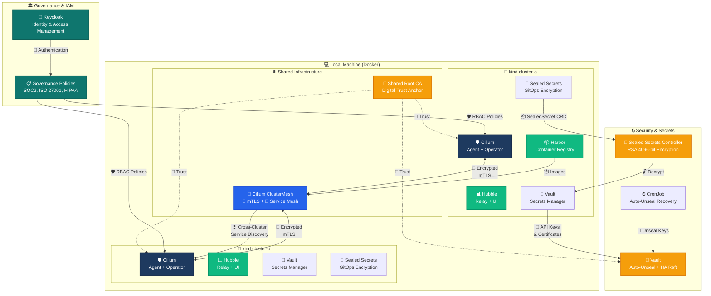
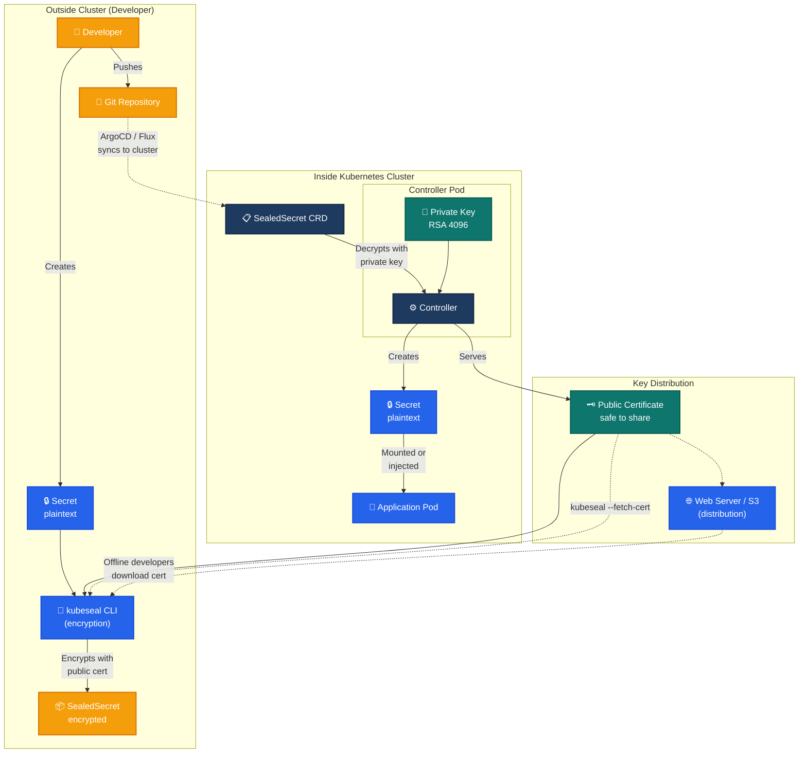
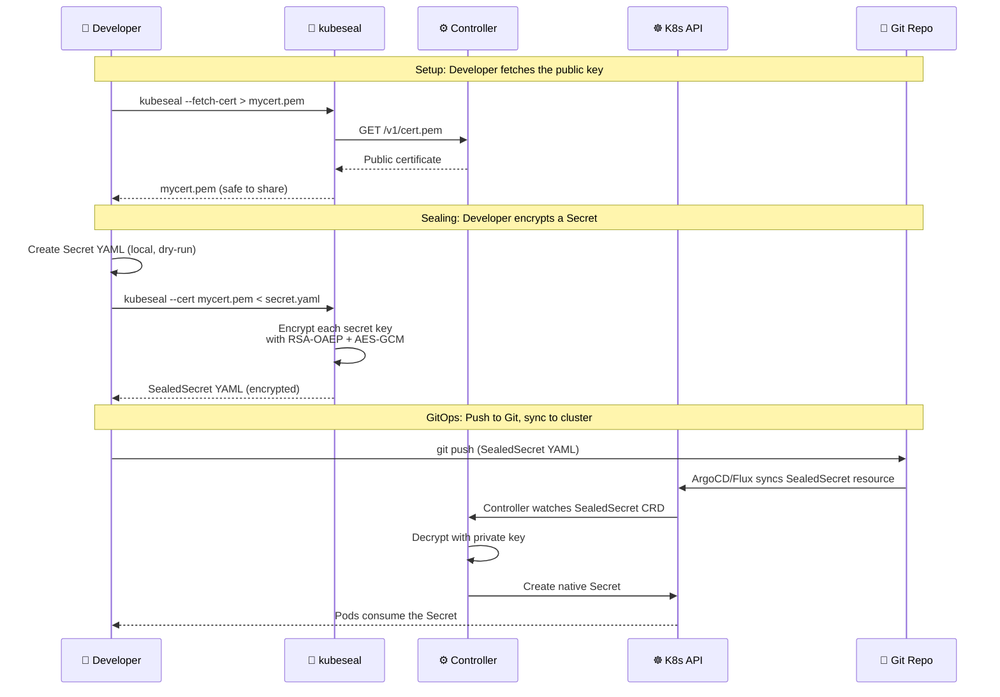
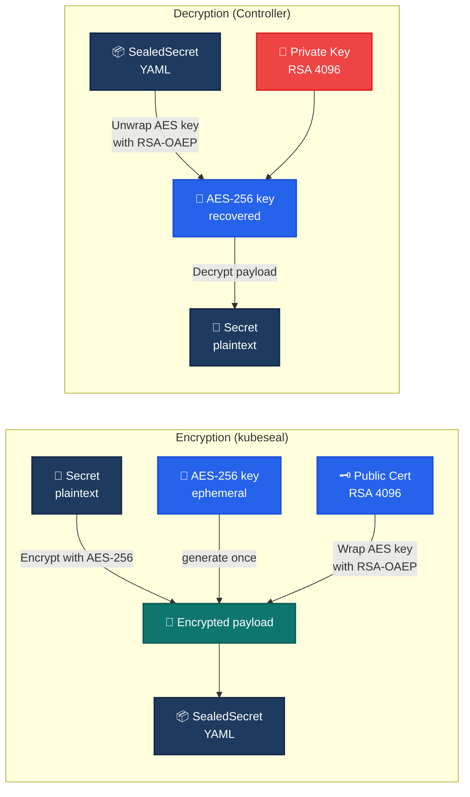
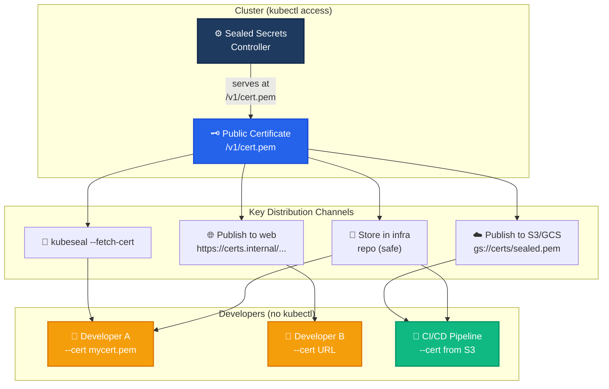
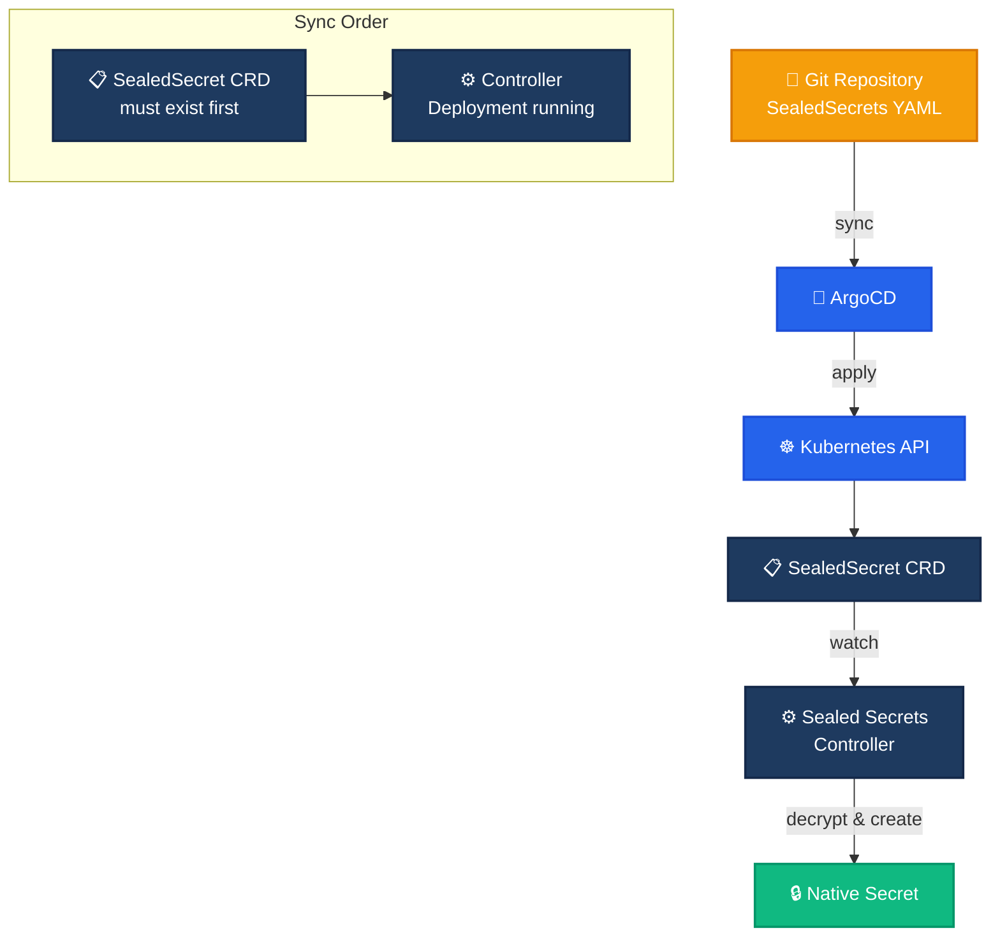
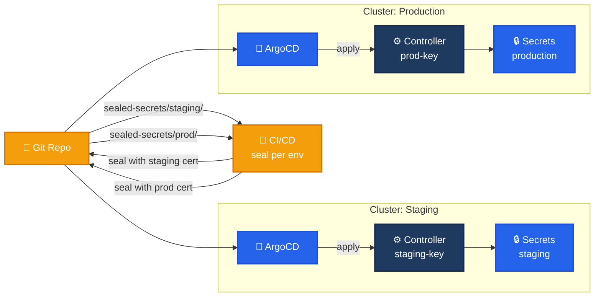

# Sealed Secrets — GitOps-Native Secret Encryption

[Sealed Secrets](https://github.com/bitnami/sealed-secrets) by Bitnami is a Kubernetes controller and CLI tool that lets you **encrypt Kubernetes Secrets into safe-to-store `SealedSecret` custom resources**. The encrypted `SealedSecret` can be committed to any repository (even public ones) and decrypted only by the controller running in your target cluster.

---

## 🗺️ Infrastructure Architecture Overview



---

## Architecture



### How It Works — Step by Step



## Core Concepts

### Cryptographic Model

Sealed Secrets uses **asymmetric encryption** with RSA 4096-bit keys:



Each value in `spec.encryptedData` is independently encrypted:
1. A random AES-256 key is generated per value.
2. The plaintext value is encrypted with that AES key (AES-GCM).
3. The AES key itself is wrapped (encrypted) with the RSA public key (RSA-OAEP).
4. The combined payload (encrypted value + wrapped key) is stored in the SealedSecret.

### The SealedSecret Custom Resource

```yaml
apiVersion: bitnami.com/v1alpha1
kind: SealedSecret
metadata:
  name: mysecret
  namespace: mynamespace
spec:
  encryptedData:
    password: AgBy3i4OJSWK+PiTySYZZA9rO43cGDEq.....
  template:
    type: Opaque
    metadata:
      labels:
        app: myapp
      annotations:
        sealedsecrets.bitnami.com/managed: "true"
```

The controller unseals this into a native `Secret`:

```yaml
apiVersion: v1
kind: Secret
metadata:
  name: mysecret
  namespace: mynamespace
  labels:
    app: myapp
  ownerReferences:
    - apiVersion: bitnami.com/v1alpha1
      kind: SealedSecret
      name: mysecret
type: Opaque
data:
  password: cGFzc3dvcmQxMjM=  # base64 "password123"
```

### Sealing Scopes

| Scope | Name Locked | Namespace Locked | Use Case |
|-------|-------------|------------------|----------|
| `strict` (default) | Yes | Yes | Maximum security — secret is pinned to one name+namespace |
| `namespace-wide` | No | Yes | Can rename the SealedSecret within a namespace |
| `cluster-wide` | No | No | Can move to any namespace, any name |

```bash
# Strict scope (default)
kubeseal < secret.yaml > sealed.yaml

# Namespace-wide
kubeseal --scope namespace-wide < secret.yaml > sealed.yaml

# Cluster-wide
kubeseal --scope cluster-wide < secret.yaml > sealed.yaml
```

## Installation

### Controller

```bash
# Deploy the controller
kubectl apply -f https://github.com/bitnami/sealed-secrets/releases/latest/download/controller.yaml

# Or with Helm
helm repo add sealed-secrets https://bitnami.github.io/sealed-secrets
helm install sealed-secrets -n kube-system \
  --set-string fullnameOverride=sealed-secrets-controller \
  sealed-secrets/sealed-secrets
```

### Kubeseal CLI

```bash
# macOS
brew install kubeseal

# Linux
KUBESEAL_VERSION=$(curl -sL https://api.github.com/repos/bitnami/sealed-secrets/tags | \
  jq -r '.[0].name' | cut -c2-)
curl -OL "https://github.com/bitnami/sealed-secrets/releases/download/v${KUBESEAL_VERSION}/kubeseal-${KUBESEAL_VERSION}-linux-amd64.tar.gz"
tar -xvzf kubeseal-${KUBESEAL_VERSION}-linux-amd64.tar.gz kubeseal
sudo install -m 755 kubeseal /usr/local/bin/kubeseal
```

## Usage — Sealing Secrets

### Basic Workflow

```bash
# 1. Create a Secret locally (dry-run)
kubectl create secret generic db-credentials \
  --from-literal=username=admin \
  --from-literal=password=s3cret \
  --dry-run=client -o yaml > secret.yaml

# 2. Seal it
kubeseal -f secret.yaml -w sealed-secret.yaml

# 3. The sealed YAML is safe to commit
cat sealed-secret.yaml

# 4. Apply to the cluster
kubectl apply -f sealed-secret.yaml

# 5. Verify the unsealed Secret exists
kubectl get secret db-credentials
```

### Raw Mode (without kubectl)

```bash
# Encrypt a single value directly
echo -n "my-password" | kubeseal --raw \
  --namespace myapp \
  --name db-credentials

# Output: AgBChHUWLMx...
```

## Sharing Keys Without kubectl Access

One of the most common questions is: **How can developers seal secrets without direct kubectl access to the cluster?**

The answer is that the **public certificate is all that's needed to seal secrets**, and it is safe to share with anyone.

### The Key Distribution Model



### Method 1: Fetch Certificate Once, Distribute as File

```bash
# Admin (with kubectl access) fetches the certificate once
kubeseal --fetch-cert > sealed-secrets-cert.pem

# Share the file securely (or in a private repo)
# The certificate is PUBLIC — it's the encryption key, not the decryption key

# Developer (no kubectl) seals offline
kubeseal --cert sealed-secrets-cert.pem \
  -f secret.yaml -w sealed-secret.yaml
```

### Method 2: Publish Certificate to a Web Server

```bash
# Admin publishes the certificate
kubeseal --fetch-cert | \
  gsutil cp - gs://my-org-sealed-secrets-certs/prod-cluster.pem

# Developer seals using the URL
kubeseal --cert https://storage.googleapis.com/my-org-sealed-secrets-certs/prod-cluster.pem \
  -f secret.yaml -w sealed-secret.yaml

# Or using environment variable
export SEALED_SECRETS_CERT=https://storage.googleapis.com/my-org-sealed-secrets-certs/prod-cluster.pem
kubeseal -f secret.yaml -w sealed-secret.yaml
```

### Method 3: Controller URL (kubectl Required)

If a developer has kubectl configured but limited permissions (e.g., cannot read Secrets), they can still fetch the cert from the controller directly:

```bash
# Works without any special RBAC — the controller serves the cert anonymously
kubeseal --fetch-cert > mycert.pem

# Or inline
kubeseal -f secret.yaml -w sealed-secret.yaml
```

### CI/CD Pipeline Integration

```yaml
# .github/workflows/seal-secrets.yml
jobs:
  seal:
    steps:
      - run: |
          # Download the public cert from a secure distribution point
          curl -o sealed-cert.pem https://certs.internal/sealed-secrets/prod.pem

          # Seal secrets for the target environment
          for env in staging prod; do
            kubeseal --cert sealed-cert.pem \
              -f secrets/$env/secret.yaml \
              -w sealed-secrets/$env/sealed-secret.yaml
          done
```

## ArgoCD Integration

Sealed Secrets works naturally with ArgoCD and other GitOps tools because SealedSecrets are *just Kubernetes manifests* that can be tracked in Git.

### How ArgoCD Syncs SealedSecrets



### Sync Order with ArgoCD

```yaml
# Application: sealed-secrets-infra.yaml
# This must be deployed FIRST — installs the CRD and controller
apiVersion: argoproj.io/v1alpha1
kind: Application
metadata:
  name: sealed-secrets-controller
spec:
  source:
    repoURL: https://github.com/bitnami/sealed-secrets
    path: helm/sealed-secrets
    targetRevision: main
    helm:
      releaseName: sealed-secrets
      values: |
        fullnameOverride: sealed-secrets-controller
  destination:
    server: https://kubernetes.default.svc
    namespace: kube-system
  syncPolicy:
    automated:
      prune: true
      selfHeal: true
```

```yaml
# Application: app-secrets.yaml
# This deploys SealedSecrets — depends on controller being ready
apiVersion: argoproj.io/v1alpha1
kind: Application
metadata:
  name: app-secrets
spec:
  source:
    repoURL: https://github.com/myorg/app-config
    path: sealed-secrets/
    targetRevision: main
  destination:
    server: https://kubernetes.default.svc
    namespace: myapp
  syncPolicy:
    automated:
      prune: true
      selfHeal: true
```

### ArgoCD Sync Waves

Use sync waves to ensure the controller is ready before SealedSecrets are applied:

```yaml
apiVersion: argoproj.io/v1alpha1
kind: Application
metadata:
  name: sealed-secrets-controller
  annotations:
    argocd.argoproj.io/sync-wave: "-5"  # Deploy first
spec:
  ...
---
apiVersion: argoproj.io/v1alpha1
kind: Application
metadata:
  name: app-secrets
  annotations:
    argocd.argoproj.io/sync-wave: "0"  # Deploy after controller is healthy
spec:
  ...
```

### ArgoCD Resource Pruning

When a SealedSecret is deleted from Git, ArgoCD will prune it from the cluster. The controller will see the SealedSecret is gone and delete the corresponding Secret. This is the **default behavior** — the Secret is owned by the SealedSecret via `ownerReferences`.

To decouple them (keep the Secret if the SealedSecret is deleted), add this annotation *before* sealing:

```yaml
metadata:
  annotations:
    sealedsecrets.bitnami.com/skip-set-owner-references: "true"
```

### ArgoCD + Multi-Cluster Workflow



Each cluster has its own controller with a unique key pair. Secrets must be sealed with the **target cluster's** certificate. A CI pipeline can seal secrets for multiple clusters by using the appropriate cert.

## Secret Rotation

### Key Renewal

The controller automatically renews the sealing key every 30 days. Old keys are **not deleted** — existing SealedSecrets remain decryptable.

```bash
# Configure renewal period (deployment flag)
--key-renew-period=720h  # 30 days (default)
--key-renew-period=0     # Disable automatic renewal
```

### Rotating the Actual Secret Value

1. Update the plaintext Secret locally.
2. Re-seal with `kubeseal`.
3. Commit the updated SealedSecret YAML to Git.
4. ArgoCD syncs the change to the cluster.

```bash
# Roll a new password
echo -n "${NEW_PASSWORD}" | kubectl create secret generic db-credentials \
  --from-file=password=/dev/stdin \
  --dry-run=client -o yaml > secret.yaml

# Re-seal
kubeseal --cert mycert.pem \
  -f secret.yaml \
  -w sealed-secrets/db-credentials.yaml

# Commit and push
git add sealed-secrets/db-credentials.yaml
git commit -m "Rotate db-credentials password"
git push
```

### Re-encrypting with a New Key

If the sealing private key is compromised:

1. Delete the old key Secret: `kubectl delete secret -n kube-system sealed-secrets-key`
2. Trigger a new key generation (restart the controller pod).
3. Re-encrypt all SealedSecrets with the new certificate using the `--re-encrypt` flag:
   ```bash
   kubeseal --re-encrypt < sealed-secret-old.yaml > sealed-secret-new.yaml
   ```
4. Apply the re-encrypted SealedSecrets.

## Production Readiness Checklist

- [ ] **Controller HA**: Run at least 2 controller replicas with `--disable-discovery=false` (default).
- [ ] **Backup the sealing key**: The private key is stored in a Secret in `kube-system`. Back it up.
  ```bash
  kubectl get secret -n kube-system sealed-secrets-key -o yaml > sealed-secrets-key-backup.yaml
  ```
- [ ] **Certificate distribution**: Automate publishing the public certificate to a web server or object store.
- [ ] **SealedSecret validation**: Use `kubeseal --validate` in CI to catch invalid SealedSecrets before they reach the cluster.
- [ ] **Sync waves in ArgoCD**: Ensure the controller Application is synced before SealedSecret Applications.
- [ ] **Monitoring**: Alert on controller errors (Prometheus metrics exposed on port 8080).
- [ ] **Audit logging**: Enable Kubernetes audit logging to track SealedSecret creation and controller activity.
- [ ] **Namespace isolation**: Use RBAC to restrict who can create SealedSecrets in each namespace.

## Directory Structure

```text
secrets-management/sealdsecrets/
├── README.md                  # This document
├── overlay/
│   ├── dev/
│   │   ├── kustomization.yaml # Dev overlay for Sealed Secrets controller
│   │   └── sealed-secrets.yaml
│   └── prod/
│       ├── kustomization.yaml # Prod overlay for Sealed Secrets controller
│       └── sealed-secrets.yaml
└── sealed-secrets/
    ├── app-credentials.yaml   # Example SealedSecret
    └── db-credentials.yaml    # Example SealedSecret
```

## Troubleshooting

### SealedSecret stuck in pending

```bash
# Check controller logs
kubectl logs -n kube-system -l app.kubernetes.io/name=sealed-secrets-controller

# Verify the CRD exists
kubectl get crd sealedsecrets.bitnami.com

# Check if the SealedSecrets namespace matches
kubectl get sealedsecret mysecret -o yaml | grep namespace
```

### "Failed to decrypt" error

```bash
# The SealedSecret was likely sealed for a different cluster or different scope.
# Verify the certificate used:
kubeseal --fetch-cert | openssl x509 -text -noout | grep Subject

# The SealedSecret's name/namespace scope must match what it was sealed for.
```

### ArgoCD sync fails on SealedSecret

```bash
# Check resource status
argocd app get app-secrets

# The CRD must be installed before ArgoCD can apply SealedSecrets.
# Ensure the controller Application is synced and healthy first.

# Check for sync errors
argocd app logs app-secrets
```

## References

- [Sealed Secrets GitHub Repository](https://github.com/bitnami/sealed-secrets)
- [Sealed Secrets Release Notes](https://github.com/bitnami/sealed-secrets/releases)
- [ArgoCD Documentation](https://argo-cd.readthedocs.io/)
- [Kubernetes Secrets](https://kubernetes.io/docs/concepts/configuration/secret/)
