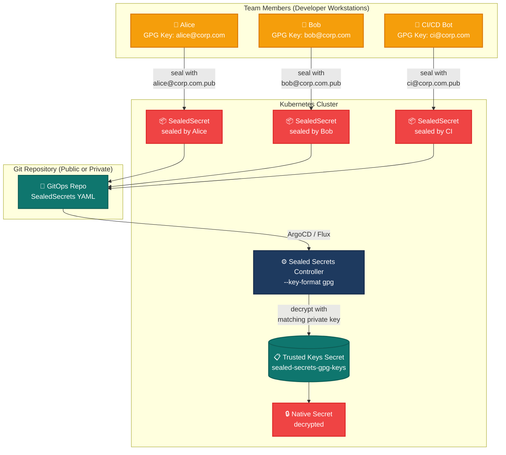
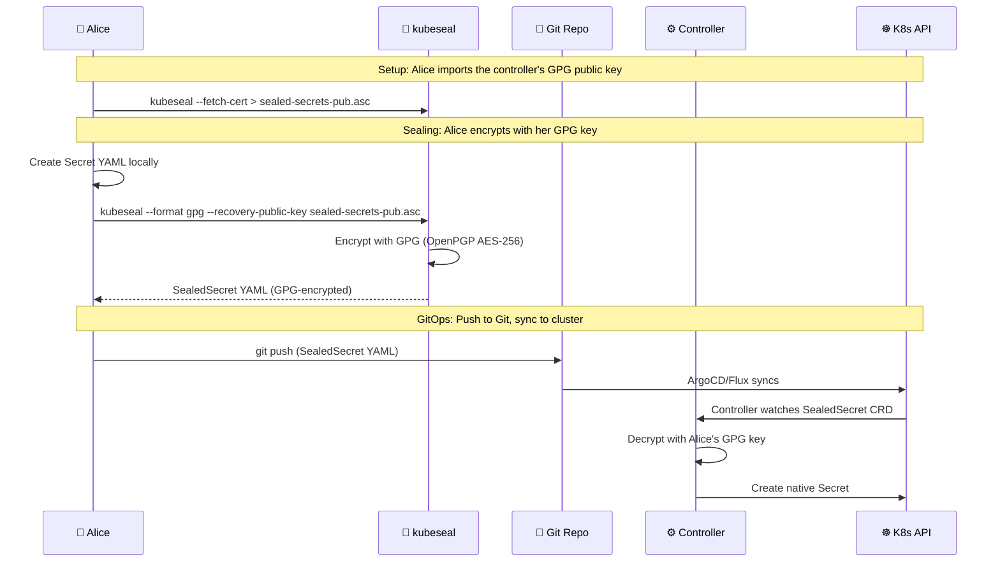
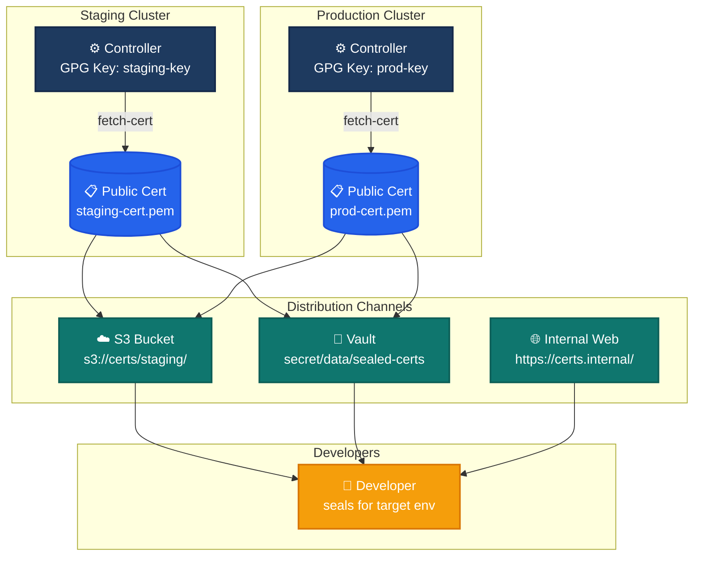
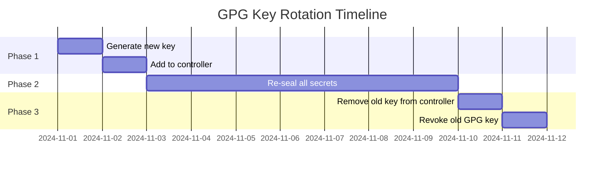

# Sealed Secrets with GPG — Multi-User How-To Guide

> **Scenario:** A team of developers needs to seal Kubernetes Secrets for a shared
> GitOps repository. Each developer has their own GPG key, and the Sealed Secrets
> controller is configured to accept **multiple GPG public keys** so that any
> team member can seal secrets that only the controller (or other authorized
> team members) can unseal.

---

## Table of Contents

1. [Problem Statement](#problem-statement)
2. [Architecture Overview](#architecture-overview)
3. [Prerequisites](#prerequisites)
4. [Step 1 — Generate GPG Keys for Each Team Member](#step-1--generate-gpg-keys-for-each-team-member)
5. [Step 2 — Export Public Keys](#step-2--export-public-keys)
6. [Step 3 — Deploy Sealed Secrets Controller with GPG](#step-3--deploy-sealed-secrets-controller-with-gpg)
7. [Step 4 — Seal Secrets per User](#step-4--seal-secrets-per-user)
8. [Step 5 — Verify Decryption](#step-5--verify-decryption)
9. [Step 6 — Multi-Cluster Key Distribution](#step-6--multi-cluster-key-distribution)
10. [Step 7 — Key Rotation](#step-7--key-rotation)
11. [Step 8 — RBAC Integration](#step-8--rbac-integration)
12. [Step 9 — CI/CD Pipeline Integration](#step-9--cicd-pipeline-integration)
13. [Step 10 — Observability & Monitoring](#step-10--observability--monitoring)
14. [Security Best Practices](#security-best-practices)
15. [Troubleshooting](#troubleshooting)
16. [References](#references)

---

## Problem Statement

In a team environment, the default Sealed Secrets controller uses a single RSA
key pair generated at startup. This creates several problems:

| Problem | Impact |
|---------|--------|
| Single point of compromise | If the RSA key leaks, all secrets are exposed |
| No per-user audit trail | Cannot identify who sealed which secret |
| Key rotation breaks all secrets | Rotating the single key invalidates every SealedSecret |
| No multi-team support | Different teams cannot use different trust boundaries |

**GPG-based Sealed Secrets solves this** by allowing the controller to accept
multiple OpenPGP key pairs. Each team member generates their own GPG key, and the
controller can decrypt secrets sealed with **any** of the trusted public keys.

---

## Architecture Overview



### How GPG Sealing Works



---

## Prerequisites

| Tool | Version | Purpose | Install |
|------|---------|---------|---------|
| `kubectl` | ≥ 1.21 | Kubernetes CLI | [Install](https://kubernetes.io/docs/tasks/tools/) |
| `kubeseal` | ≥ 0.24 | Seal secrets CLI | `brew install kubeseal` or [GitHub](https://github.com/bitnami/sealed-secrets/releases) |
| `gpg` / `gpg2` | ≥ 2.2 | GPG key management | Pre-installed on most Linux/macOS |
| `helm` | ≥ 3.10 | Controller deployment | [Install](https://helm.sh/docs/intro/install/) |
| Kind cluster | latest | Local dev environment | `go install sigs.k8s.io/kind@latest` |

---

## Step 1 — Generate GPG Keys for Each Team Member

Each team member generates their own GPG key pair. The **public key** is shared
with the controller; the **private key** stays on the developer's workstation.

### Non-Interactive Generation (Scripted)

```bash
#!/usr/bin/env bash
# generate-gpg-key.sh — Generate a GPG key for Sealed Secrets
set -euo pipefail

USER_NAME="${1:?Usage: $0 <name>}"
USER_EMAIL="${2:?Usage: $0 <email>}"
EXPIRY="${3:-1y}"  # Default: 1 year

cat <<EOF | gpg --batch --gen-key
Key-Type: RSA
Key-Length: 4096
Subkey-Type: RSA
Subkey-Length: 4096
Name-Real: ${USER_NAME}
Name-Email: ${USER_EMAIL}
Expire-Date: ${EXPIRY}
%no-protection
%commit
EOF

echo "Generated key for ${USER_NAME} <${USER_EMAIL}>"
gpg --list-keys "${USER_EMAIL}"
```

### Interactive Generation

```bash
gpg --full-generate-key
# Select: RSA and RSA (4096 bits)
# Enter name and email
# Set expiration (recommend 1 year)
# Enter passphrase (use a strong one)
```

### Verify the Key

```bash
gpg --list-keys --keyid-format long
# Example output:
# pub   rsa4096/ABCD1234EFGH5678 2024-01-15 [SC] [expires: 2025-01-15]
#       ABCDEF1234567890ABCDEF1234567890ABCDEF12
# uid                 [ultimate] Alice <alice@corp.com>
# sub   rsa4096/IJKL9012MNOP3456 2024-01-15 [E] [expires: 2025-01-15]
```

---

## Step 2 — Export Public Keys

Export each team member's public key in ASCII-armored format for the controller.

### Per-User Export

```bash
# Export Alice's public key
gpg --armor --export alice@corp.com > alice@corp.com.pub.asc

# Export Bob's public key
gpg --armor --export bob@corp.com > bob@corp.com.pub.asc

# Export CI bot's public key
gpg --armor --export ci@corp.com > ci@corp.com.pub.asc

# Note: On macOS, use 'gpg' instead of 'gpg2'. The --armor flag is portable.
```

### Combine into a Single Trusted Keys File

The Sealed Secrets controller expects **all trusted public keys** in a single
file. Concatenate them:

```bash
cat alice@corp.com.pub.asc \
    bob@corp.com.pub.asc \
    ci@corp.com.pub.asc \
    > sealed-secrets-trusted-keys.asc
```

### Store in a Kubernetes Secret

```bash
kubectl create secret generic sealed-secrets-gpg-keys \
  --namespace kube-system \
  --from-file=secrets.io=sealed-secrets-trusted-keys.asc
```

> **Important:** The Secret key must be `secrets.io` (this is the expected
> key name by the controller's GPG configuration).

---

## Step 3 — Deploy Sealed Secrets Controller with GPG

### Helm Values

Create `helm-values.yaml`:

```yaml
# helm-values.yaml — Sealed Secrets Controller with GPG multi-key support
replicaCount: 2

# GPG configuration
sealedsecrets:
  # Mount the GPG keys secret
  secretName: sealed-secrets-gpg-keys
  # Use GPG key format (not RSA)
  keyFormat: gpg

# Resource limits (production sizing)
resources:
  requests:
    cpu: 100m
    memory: 128Mi
  limits:
    cpu: 500m
    memory: 256Mi

# Security context
securityContext:
  runAsNonRoot: true
  runAsUser: 1000
  runAsGroup: 1000
  fsGroup: 1000
  capabilities:
    drop: ["ALL"]

# Service monitor for Prometheus (observability)
serviceMonitor:
  enabled: true
  namespace: monitoring
  interval: 30s

# Pod disruption budget (reliability)
podDisruptionBudget:
  enabled: true
  minAvailable: 1

# Topology spread (reliability — avoid single node)
topologySpreadConstraints:
  - maxSkew: 1
    topologyKey: kubernetes.io/hostname
    whenUnsatisfiable: DoNotSchedule
    labelSelector:
      matchLabels:
        app.kubernetes.io/name: sealed-secrets
```

### Install with Helm

```bash
helm repo add sealed-secrets https://bitnami.github.io/sealed-secrets
helm repo update

helm install sealed-secrets sealed-secrets/sealed-secrets \
  --namespace kube-system \
  --values helm-values.yaml \
  --wait
```

### Verify Controller is Running with GPG

```bash
kubectl get pods -n kube-system -l app.kubernetes.io/name=sealed-secrets

# Check controller logs for GPG key loading
kubectl logs -n kube-system -l app.kubernetes.io/name=sealed-secrets \
  --tail=50 | grep -i gpg

# Expected: "Loading GPG keys from /tmp/sealed-secrets/key"
```

---

## Step 4 — Seal Secrets per User

### Alice Seals a Secret

```bash
# Create the plaintext Secret
kubectl create secret generic db-credentials \
  --namespace myapp \
  --from-literal=username=admin \
  --from-literal=password=s3cret123 \
  --dry-run=client -o yaml > secret.yaml

# Seal it (Alice uses the controller's public cert)
# Note: --controller-namespace and --controller-name default to kube-system/sealed-secrets.
# If your controller is deployed elsewhere, add:
#   --controller-namespace sealed-secrets --controller-name sealed-secrets-controller
kubeseal --format gpg \
  --recovery-public-key <(kubectl get secret sealed-secrets-gpg-keys \
    -n kube-system -o jsonpath='{.data.secrets\.io}' | base64 --decode 2>/dev/null || \
    kubectl get secret sealed-secrets-gpg-keys \
    -n kube-system -o jsonpath='{.data.secrets\.io}' | base64 -D) \
  -f secret.yaml \
  -w sealed-secret.yaml

# The sealed YAML is safe to commit
cat sealed-secret.yaml
```

### Bob Seals a Secret (Different Namespace)

```bash
# Bob seals a secret for the production namespace
kubectl create secret generic api-keys \
  --namespace production \
  --from-literal=stripe=sk_live_xxx \
  --from-literal=sendgrid=SG.xxx \
  --dry-run=client -o yaml > prod-secret.yaml

# Seal with Bob's GPG key (same process, different key)
kubeseal --format gpg \
  --recovery-public-key sealed-secrets-trusted-keys.asc \
  --scope namespace-wide \
  -f prod-secret.yaml \
  -w sealed-prod-secret.yaml
```

### CI/CD Pipeline Seals Automatically

```bash
# In CI, use the controller's cert fetched at build time
curl -s -o sealed-cert.pem https://sealed-secrets.internal/cert

kubeseal --format gpg \
  --recovery-public-key sealed-cert.pem \
  -f secrets/config.yaml \
  -w sealed-secrets/config.yaml
```

---

## Step 5 — Verify Decryption

### Apply the SealedSecret

```bash
kubectl apply -f sealed-secret.yaml
```

### Verify the Native Secret Was Created

```bash
kubectl get secret db-credentials -n myapp -o yaml

# Expected: Secret with decrypted data
# data:
#   password: czNjcmV0MTIz  (base64 of "s3cret123")
#   username: YWRtaW4=      (base64 of "admin")
```

### Verify via Controller Logs

```bash
kubectl logs -n kube-system -l app.kubernetes.io/name=sealed-secrets \
  --tail=20

# Expected: "SealedSecret db-credentials/myapp decrypted successfully"
```

---

## Step 6 — Multi-Cluster Key Distribution

In a multi-cluster setup (staging + production), each cluster has its own
controller with its own GPG keys. Developers need the **target cluster's**
public key to seal secrets for that environment.

### Key Distribution Architecture



### Automated Key Fetch Script

```bash
#!/usr/bin/env bash
# fetch-sealed-secrets-cert.sh — Fetch the public cert from the target cluster
set -euo pipefail

CLUSTER="${1:?Usage: $0 <cluster-context>}"
OUTPUT_DIR="${2:-./certs}"

mkdir -p "${OUTPUT_DIR}"

echo "Fetching sealed-secrets cert from cluster: ${CLUSTER}"
kubectl --context "${CLUSTER}" get secret sealed-secrets-gpg-keys \
  -n kube-system \
  -o jsonpath='{.data.secrets\.io}' | base64 -d \
  > "${OUTPUT_DIR}/${CLUSTER}-sealed-secrets.asc"

echo "Cert saved to ${OUTPUT_DIR}/${CLUSTER}-sealed-secrets.asc"
```

---

## Step 7 — Key Rotation

GPG keys expire. Plan rotation **before** expiration to avoid breaking secrets.

### Rotation Procedure



### Step-by-Step Rotation

```bash
# 1. Generate new key (before old key expires)
./generate-gpg-key.sh "Alice v2" alice-v2@corp.com 1y

# 2. Export new public key
gpg --armor --export alice-v2@corp.com > alice-v2@corp.com.pub.asc

# 3. Add new key to controller (keep old key temporarily)
kubectl get secret sealed-secrets-gpg-keys -n kube-system -o yaml > keys.yaml

# Append new key to the existing trusted keys file (old key stays)
cat alice-v2@corp.com.pub.asc >> sealed-secrets-trusted-keys.asc

kubectl create secret generic sealed-secrets-gpg-keys \
  --namespace kube-system \
  --from-file=secrets.io=sealed-secrets-trusted-keys.asc \
  --dry-run=client -o yaml | kubectl apply -f -

# 4. Re-seal all secrets with the new key
for f in sealed-secrets/*.yaml; do
  kubeseal --format gpg \
    --recovery-public-key sealed-secrets-trusted-keys.asc \
    -f "$f" -w "$f" --re-encrypt
  echo "Re-encrypted: $f"
done

# 5. After all secrets are re-sealed, remove old key
# (only after confirming all secrets work with the new key)
```

---

## Step 8 — RBAC Integration

Restrict who can create/manage SealedSecrets using Kubernetes RBAC.

### Role: Can Create SealedSecrets (Not Native Secrets)

```yaml
# sealed-secrets-rbac.yaml
apiVersion: rbac.authorization.k8s.io/v1
kind: Role
metadata:
  name: sealed-secret-creator
  namespace: myapp
rules:
  - apiGroups: ["bitnami.com"]
    resources: ["sealedsecrets"]
    verbs: ["create", "get", "list", "watch", "update", "patch", "delete"]
  - apiGroups: [""]
    resources: ["secrets"]
    verbs: []  # Explicitly deny direct secret access
---
apiVersion: rbac.authorization.k8s.io/v1
kind: RoleBinding
metadata:
  name: sealed-secret-creator-binding
  namespace: myapp
subjects:
  - kind: Group
    name: developers
    apiGroup: rbac.authorization.k8s.io
roleRef:
  kind: Role
  name: sealed-secret-creator
  apiGroup: rbac.authorization.k8s.io
```

### ClusterRole: Read-Only on SealedSecrets

```yaml
apiVersion: rbac.authorization.k8s.io/v1
kind: ClusterRole
metadata:
  name: sealed-secret-viewer
rules:
  - apiGroups: ["bitnami.com"]
    resources: ["sealedsecrets"]
    verbs: ["get", "list", "watch"]
```

---

## Step 9 — CI/CD Pipeline Integration

### GitHub Actions Example

```yaml
# .github/workflows/seal-secrets.yml
name: Seal Secrets
on:
  push:
    paths:
      - 'secrets/**'

jobs:
  seal:
    runs-on: ubuntu-latest
    steps:
      - uses: actions/checkout@v4

      - name: Install kubeseal
        run: |
          KUBESEAL_VERSION=$(curl -sL https://api.github.com/repos/bitnami/sealed-secrets/tags | \
            jq -r '.[0].name' | cut -c2-)
          curl -OL "https://github.com/bitnami/sealed-secrets/releases/download/v${KUBESEAL_VERSION}/kubeseal-${KUBESEAL_VERSION}-linux-amd64.tar.gz"
          tar -xzf kubeseal-${KUBESEAL_VERSION}-linux-amd64.tar.gz kubeseal
          sudo install -m 755 kubeseal /usr/local/bin/kubeseal

      - name: Fetch controller cert
        run: |
          # Store cert in GitHub Secrets (base64-encoded)
          echo "${{ secrets.SEALED_SECRETS_CERT }}" | base64 -d > sealed-cert.pem

      - name: Seal secrets
        run: |
          for f in secrets/*.yaml; do
            kubeseal --format gpg \
              --recovery-public-key sealed-cert.pem \
              -f "$f" \
              -w "sealed-secrets/$(basename "$f")"
          done

      - name: Commit sealed secrets
        run: |
          git config user.name "CI Bot"
          git config user.email "ci@corp.com"
          git add sealed-secrets/
          git diff --cached --quiet || git commit -m "chore: seal secrets [skip ci]"
          git push
```

---

## Step 10 — Observability & Monitoring

### Prometheus Metrics

The controller exposes metrics on port 8080:

| Metric | Type | Description |
|--------|------|-------------|
| `sealed_secrets_unseal_errors_total` | Counter | Decryption failures |
| `sealed_secrets_unseal_success_total` | Counter | Successful decryptions |
| `sealed_secrets_controller_reconcile_duration_seconds` | Histogram | Reconcile latency |

### Alert Rules

```yaml
# sealed-secrets-alerts.yaml
apiVersion: monitoring.coreos.com/v1
kind: PrometheusRule
metadata:
  name: sealed-secrets-alerts
  namespace: monitoring
spec:
  groups:
    - name: sealed-secrets
      rules:
        - alert: SealedSecretDecryptFailure
          expr: rate(sealed_secrets_unseal_errors_total[5m]) > 0
          for: 5m
          labels:
            severity: warning
          annotations:
            summary: "Sealed Secrets decryption failures detected"
            description: "{{ $value }} errors/sec in {{ $labels.namespace }}"

        - alert: SealedSecretPending
          expr: |
            kube_customresource_sealedsecret_status_condition{condition="Ready",status="false"} == 1
          for: 10m
          labels:
            severity: warning
          annotations:
            summary: "SealedSecret stuck in unready state"
```

### Grafana Dashboard

Key panels to monitor:

1. **Seal/Unseal Rate** — requests per second
2. **Error Rate** — failed decryptions
3. **Controller Pod Health** — restarts, CPU/memory
4. **SealedSecret Age** — secrets approaching key expiration

---

## Security Best Practices

### Do

- **Use GPG keys with expiration dates** (1 year recommended)
- **Store private keys in a hardware token or password manager** — never on shared drives
- **Rotate keys proactively** — start 30 days before expiration
- **Use `--scope namespace-wide`** for flexibility without going full `cluster-wide`
- **Validate SealedSecrets in CI** — `kubeseal --validate` catches errors early
- **Enable etcd encryption at rest** — SealedSecrets are encrypted in YAML but etcd stores the native Secrets
- **Run controller as non-root** with read-only root filesystem

### Don't

- **Never commit GPG private keys** to Git, even private repos
- **Never use `cluster-wide` scope** unless strictly necessary
- **Never share GPG passphrases** — use individual keys per person
- **Never disable controller resource limits** — runaway decryption could DoS the node
- **Never store the controller's private key backup alongside the cluster** — use offline storage

---

## Troubleshooting

### "No key could decrypt the Secret"

```bash
# The SealedSecret was sealed with a key the controller doesn't trust.
# Check which keys the controller has:
kubectl get secret sealed-secrets-gpg-keys -n kube-system \
  -o jsonpath='{.data.secrets\.io}' | base64 -d | grep -c "pub"

# Ensure the sealing key's fingerprint matches one of the trusted keys.
kubeseal --fetch-cert | gpg --import-options show-only --import
```

### Controller Not Loading GPG Keys

```bash
# Check controller logs for key loading errors
kubectl logs -n kube-system -l app.kubernetes.io/name=sealed-secrets --tail=100

# Verify the Secret exists and has the right key name
kubectl get secret sealed-secrets-gpg-keys -n kube-system -o yaml

# The Secret MUST have key "secrets.io" (not "sealed-secrets-pub.asc")
```

### Secret Created but Immediately Deleted

```bash
# The SealedSecret's name/namespace scope may not match
kubectl get sealedsecret mysecret -n myapp -o yaml

# Check if ownerReferences are causing deletion
# Add annotation to skip owner references:
#   sealedsecrets.bitnami.com/skip-set-owner-references: "true"
```

### Controller CrashLoopBackOff

```bash
# Check if the GPG key file is malformed
kubectl exec -n kube-system <controller-pod> -- \
  gpg --import-options show-only --import /tmp/sealed-secrets/key

# Ensure all keys in the combined file are ASCII-armored
grep -c "BEGIN PGP PUBLIC KEY BLOCK" sealed-secrets-trusted-keys.asc
```

---

## Directory Structure

```text
secrets-management/sealdsecrets/gpg-multi-user/
├── README.md                      # This document
├── helm-values.yaml               # Controller Helm values (GPG mode)
├── base/
│   ├── kustomization.yaml         # Base Kustomize (namespace only)
│   └── namespace.yaml             # Namespace with Pod Security Standards
├── overlays/
│   ├── dev/
│   │   └── kustomization.yaml     # Dev overlay (1 replica, inline patches)
│   └── prod/
│       └── kustomization.yaml     # Prod overlay (2 replicas, inline patches)
├── scripts/
│   ├── generate-gpg-key.sh        # Generate a GPG key for a team member
│   ├── fetch-cert.sh              # Fetch controller cert from a cluster
│   ├── rotate-keys.sh             # Rotate GPG keys across clusters
│   └── validate-sealed.sh         # Validate SealedSecrets in CI
├── examples/
│   ├── alice-secret.yaml          # Example: SealedSecret sealed by Alice
│   ├── bob-secret.yaml            # Example: SealedSecret sealed by Bob
│   └── rbac.yaml                  # RBAC for SealedSecret access control
└── sealed-secrets-trusted-keys.asc # Placeholder — replace with real exported public keys
```

---

## References

- [Sealed Secrets — GPG Key Management](https://github.com/bitnami/sealed-secrets#security-design)
- [OpenPGP RFC 4880](https://datatracker.ietf.org/doc/html/rfc4880)
- [Bitnami Sealed Secrets Helm Chart](https://github.com/bitnami/charts/tree/main/bitnami/sealed-secrets)
- [Kubernetes RBAC Authorization](https://kubernetes.io/docs/reference/access-authn-authz/rbac/)
- [ArgoCD Sync Waves](https://argo-cd.readthedocs.io/en/stable/user-guide/sync-waves/)
