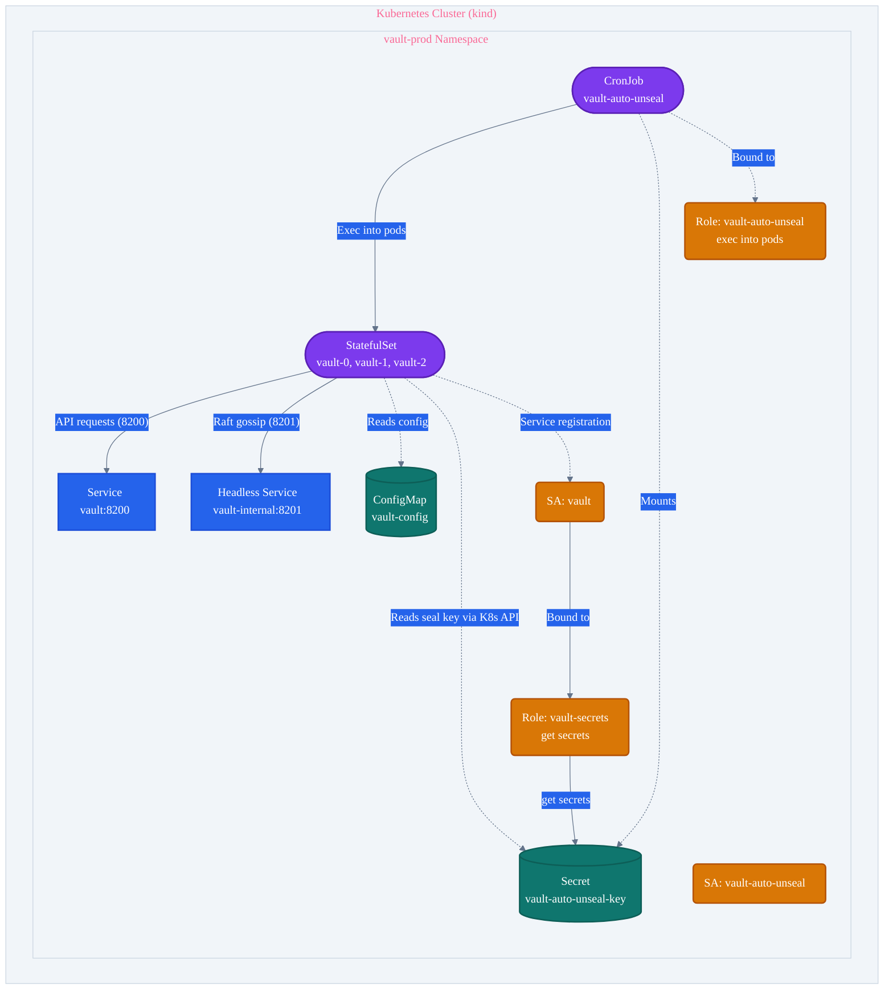
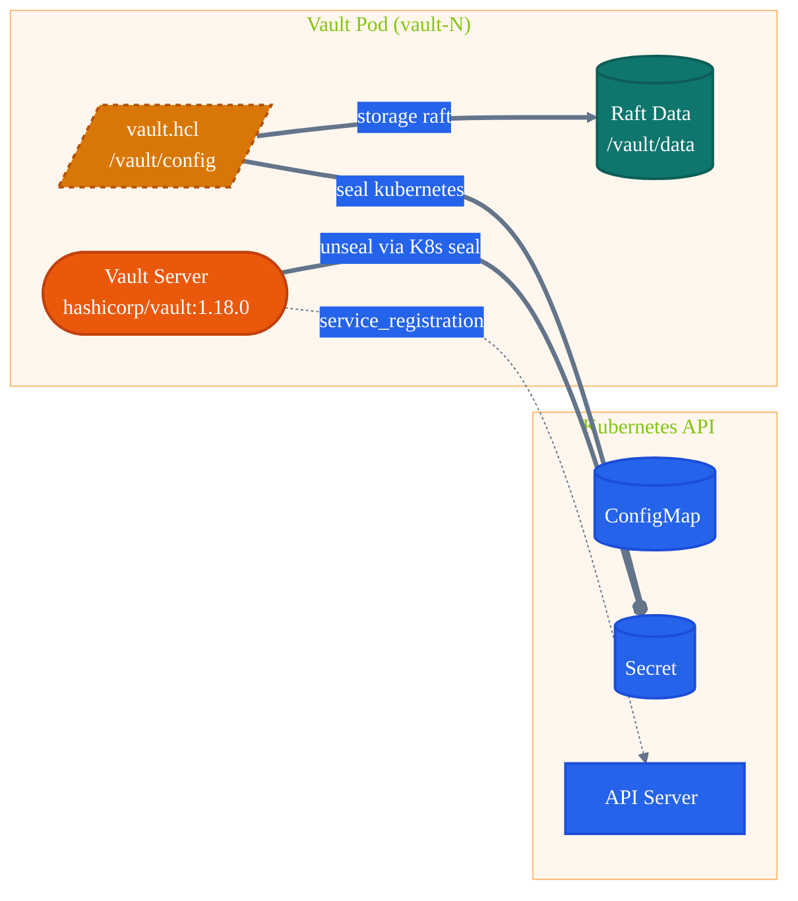
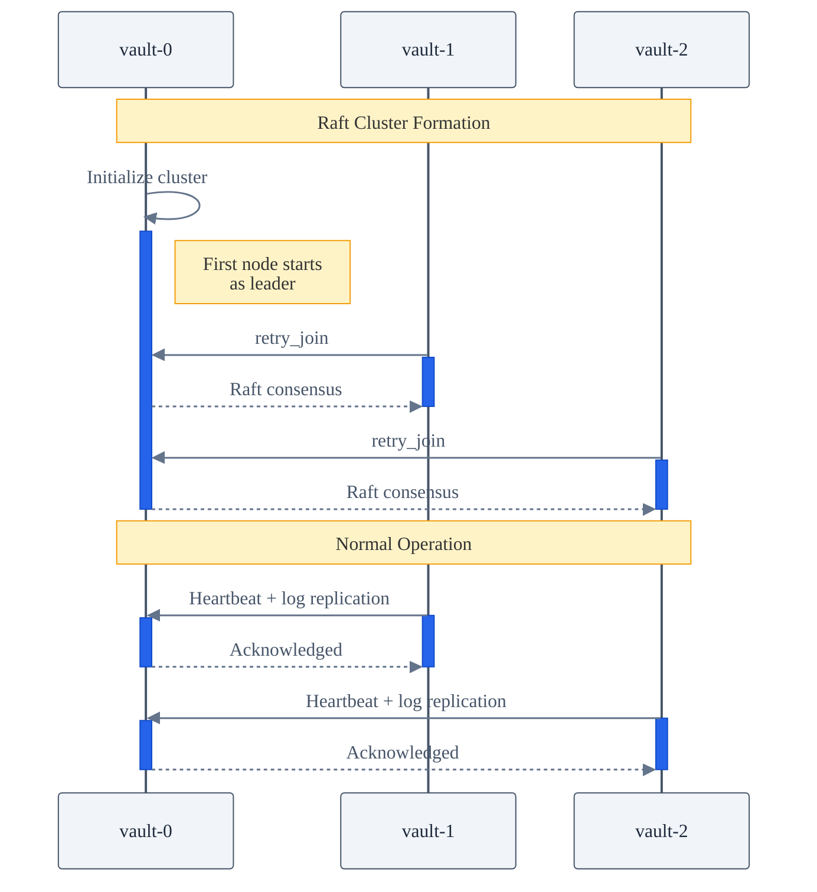

# Vault — High-Availability Secrets Management on Kind

This directory contains a Kustomize-based deployment of [HashiCorp Vault](https://www.vaultproject.io/) configured for a kind (Kubernetes in Docker) learning environment. It provides two deployment profiles — **dev** (single-replica, file-backed) and **prod** (HA Raft cluster with Kubernetes-backed auto-unseal).

## Architecture

### High-Level Design



### Component Architecture



### Key Components

| Component | Resource | Purpose |
|-----------|----------|---------|
| **Vault Server** | StatefulSet | Runs `hashicorp/vault:1.18.0` in server mode. 3 replicas for HA. |
| **Service (Client)** | ClusterIP | Exposes Vault HTTP API on port 8200 within the cluster. |
| **Service (Internal)** | Headless ClusterIP | Exposes Raft cluster port 8201 with `publishNotReadyAddresses: true` for peer discovery before pods are ready. |
| **ConfigMap** | ConfigMap | Contains `vault.hcl` with storage backend, listener, seal, and service registration config. |
| **Auto-Unseal Secret** | Opaque Secret | Stores the 32-byte hex key used by Vault's Kubernetes seal mechanism. |
| **Auto-Unseal CronJob** | CronJob | Every 5 minutes, execs into each Vault pod and unseals it if sealed. |
| **RBAC (Vault Server)** | ClusterRole + Binding | `get/list/watch` pods for service registration. |
| **RBAC (Vault Secrets)** | Role + Binding (prod) | `get` secrets in the prod namespace for auto-unseal key access. |
| **RBAC (CronJob)** | Role + Binding (prod) | `get/list` pods and `create` pods/exec for the unseal operation. |

## Security Architecture

```mermaid
%%{init: {'theme': 'base', 'themeVariables': { 'primaryColor': '#7C3AED', 'primaryTextColor': '#ffffff', 'primaryBorderColor': '#5B21B6', 'lineColor': '#64748B', 'secondaryColor': '#059669', 'tertiaryColor': '#DC2626', 'clusterBkg': '#F5F3FF', 'clusterBorder': '#C4B5FD', 'fontFamily': 'system-ui, -apple-system, sans-serif' }}}%%
flowchart TB
    subgraph "Auto-Unseal on Startup"
        A[Vault starts<br/>in sealed state] --> B[Vault reads<br/>vault.hcl]
        B --> C["seal 'kubernetes'<br/>stanza found"]
        C --> D[Authenticates to<br/>K8s API via SA token]
        D --> E[Reads Secret<br/>vault-auto-unseal-key]
        E --> F{Seal key valid?}
        F -->|Yes| G["vault operator unseal<br/>(automatic)"]
        G --> H[Vault is operational]
        F -->|No| I[Log error<br/>wait for retry]
        I --> D
    end

    subgraph "CronJob Safety Net (every 5 min)"
        J[CronJob triggers] --> K[List vault pods]
        K --> L[Exec into each pod]
        L --> M["vault status<br/>-format=json"]
        M --> N{Sealed?}
        N -->|Yes| O["vault operator unseal<br/>with key from volume mount"]
        O --> P[Pod is unsealed]
        N -->|No| Q[Skip pod]
        Q --> R[Check next pod]
        R --> L
    end

    classDef startup fill:#7C3AED,color:#ffffff,stroke:#5B21B6,stroke-width:2px
    classDef cronjob fill:#2563EB,color:#ffffff,stroke:#1D4ED8,stroke-width:2px
    classDef decision fill:#D97706,color:#ffffff,stroke:#B45309,stroke-width:2px
    classDef success fill:#059669,color:#ffffff,stroke:#047857,stroke-width:2px
    classDef failure fill:#DC2626,color:#ffffff,stroke:#B91C1C,stroke-width:2px

    class A,B,C,D,E,G startup
    class H,P success
    class I failure
    class J,K,L,M,O,Q,R cronjob
    class F,N decision
```



### Security Boundaries

- **Vault runs as non-root** (UID 100, group 1000) with read-only root filesystem, all capabilities dropped, and privilege escalation disabled.
- **Auto-unseal key** is stored in a Kubernetes Secret (base64-encoded at rest via etcd encryption if configured).
- **The CronJob reads the key from a volume mount**, not via the API (no API-level `get` permission on secrets for the CronJob SA).
- **The Vault server's SA** has a namespaced Role (not ClusterRole) for secret access, scoped to `vault-prod`.
- **TLS is disabled** (`tls_disable = true`) — this is intentional for a kind learning environment. In production, enable TLS with cert-manager.

## HA Raft Consensus



The 3-node Raft cluster provides:
- **Fault tolerance**: Survives the loss of 1 node.
- **Leader election**: If the leader fails, a new leader is elected from the remaining nodes.
- **Data replication**: All writes are replicated to a quorum (2/3) of nodes.

## Auto-Unseal Mechanism

Two complementary mechanisms ensure Vault stays unsealed:

### 1. Kubernetes Seal (Auto-Unseal on Startup)

The Vault server is configured with a `seal "kubernetes"` stanza in `vault.hcl`. On startup, Vault authenticates to the Kubernetes API using its ServiceAccount token and reads the seal key from a Secret in its own namespace. This happens automatically — no manual intervention required after initial setup.

### 2. CronJob (Periodic Unseal)

The `vault-auto-unseal` CronJob runs every 5 minutes as a safety net. It:
1. Lists all pods with label `app.kubernetes.io/name=vault`
2. For each pod, execs in and runs `vault status -format=json`
3. Checks both `initialized` and `sealed` status
4. If initialized and sealed, runs `vault operator unseal` with the key from the mounted Secret

This handles edge cases such as:
- Pod restarts after a node failure
- Rolling updates where the seal key may not be available immediately
- Manual resealing

## Directory Structure

```text
secrets-management/vault/
├── README.md
├── base/
│   ├── kustomization.yaml          # Base kustomization
│   ├── statefulset.yaml            # Vault StatefulSet (3 replicas)
│   ├── service.yaml                # ClusterIP service (port 8200)
│   ├── service-internal.yaml       # Headless service (port 8201)
│   ├── configmap.yaml              # vault.hcl with Raft + K8s service registration
│   ├── serviceaccount.yaml         # Vault ServiceAccount
│   └── rbac.yaml                   # ClusterRole + Binding for pod access
└── overlays/
    ├── dev/
    │   ├── kustomization.yaml      # Dev: 1 replica, file storage, vault-dev NS
    │   └── configmap-patch.yaml    # Dev: file backend instead of Raft
    └── prod/
        ├── kustomization.yaml      # Prod: 3 replicas, Raft, vault-prod NS
        ├── configmap-patch.yaml    # Prod: Raft + seal stanza
        ├── vault-auto-unseal-secret.yaml   # Seal key Secret (placeholder)
        ├── vault-rbac.yaml         # Namespaced Role for Vault to read secrets
        ├── auto-unseal-job.yaml    # CronJob for periodic unseal
        └── auto-unseal-rbac.yaml   # SA + Role + Binding for the CronJob
```

## How to Deploy

### Prerequisites

- A kind cluster (see `kind-bpf-a.yaml` / `kind-bpf-b.yaml` at the repo root)
- `kubectl` configured to talk to your cluster
- `kustomize` (built into `kubectl` v1.21+)

### Dev Deployment

Single-replica Vault with file-backed storage. No HA, no auto-unseal. Ideal for learning and testing.

```bash
# Create the namespace
kubectl create namespace vault-dev

# Generate the manifests (dry-run)
kubectl kustomize secrets-management/vault/overlays/dev/

# Deploy to the cluster
kubectl apply -k secrets-management/vault/overlays/dev/

# Verify
kubectl -n vault-dev get pods,svc

# Initialize Vault (single node, no auto-unseal)
kubectl -n vault-dev exec vault-0 -- vault operator init \
  -key-shares=1 -threshold=1

# Unseal (copy the unseal key from the init output)
kubectl -n vault-dev exec vault-0 -- vault operator unseal <UNSEAL_KEY>
```

**Note:** With 1 replica, the pod name is `vault-0` (StatefulSet ordinal naming).

### Production Deployment

3-node HA Raft cluster with Kubernetes-backed auto-unseal and a CronJob safety net.

```bash
# 1. Generate a 32-byte hex seal key
SEAL_KEY=$(openssl rand -hex 32)
echo "Seal key: ${SEAL_KEY}"

# 2. Update the secret with the real key
#    Edit overlays/prod/vault-auto-unseal-secret.yaml and replace
#    REPLACE_ME_WITH_32BYTE_HEX_KEY with the value of ${SEAL_KEY}

# 3. Create the namespace and deploy
kubectl create namespace vault-prod
kubectl apply -k secrets-management/vault/overlays/prod/

# 4. Verify pods are running
kubectl -n vault-prod get pods -w

# 5. Initialize Vault (run once on vault-0)
kubectl -n vault-prod exec vault-0 -- vault operator init \
  -key-shares=5 -key-threshold=3

#    Save the recovery keys and root token securely.
#    The auto-unseal mechanism will unseal Vault automatically on restart;
#    the recovery keys are only needed for disaster recovery.

# 6. vault-0 should auto-unseal via the Kubernetes seal mechanism.
#    Confirm with:
kubectl -n vault-prod exec vault-0 -- vault status

#    Troubleshooting: If the seal fails, fall back to recovery keys:
#    kubectl -n vault-prod exec vault-0 -- vault operator unseal <KEY_1>
#    kubectl -n vault-prod exec vault-0 -- vault operator unseal <KEY_2>
#    kubectl -n vault-prod exec vault-0 -- vault operator unseal <KEY_3>

# 7. Join vault-1 and vault-2 to the Raft cluster
kubectl -n vault-prod exec vault-1 -- vault operator raft join http://vault-0.vault-internal:8200
kubectl -n vault-prod exec vault-2 -- vault operator raft join http://vault-0.vault-internal:8200

# 8. Check cluster status
kubectl -n vault-prod exec vault-0 -- vault operator raft list-peers

# 9. Verify the auto-unseal CronJob is running
kubectl -n vault-prod get cronjobs

# 10. Test auto-unseal by restarting a pod
kubectl -n vault-prod delete pod vault-0
# Wait ~5 minutes for the CronJob to re-unseal it
```

### Verifying the Cluster

```bash
# Check all pods
kubectl -n vault-prod get pods

# Check Vault status on each node
for pod in vault-0 vault-1 vault-2; do
  echo "=== $pod ==="
  kubectl -n vault-prod exec "$pod" -- vault status
done

# Check Raft peers
kubectl -n vault-prod exec vault-0 -- vault operator raft list-peers

# Access Vault through the service
kubectl -n vault-prod port-forward svc/vault 8200:8200 &
curl http://127.0.0.1:8200/v1/sys/health
```

## Configuration Reference

### Vault Configuration (`vault.hcl`)

| Setting | Base | Dev | Prod |
|---------|------|-----|------|
| Storage | Raft (3 nodes) | File (1 node) | Raft (3 nodes) |
| Listener | TCP 8200/8201 | TCP 8200/8201 | TCP 8200/8201 |
| TLS | Disabled | Disabled | Disabled |
| Seal | None | None | Kubernetes (Secret) |
| Service Registration | Kubernetes | Kubernetes | Kubernetes |
| mlock | Disabled | Disabled | Disabled |

### Environment Variables

| Variable | Value | Purpose |
|----------|-------|---------|
| `VAULT_ADDR` | `http://127.0.0.1:8200` | Local API address |
| `VAULT_API_ADDR` | `http://$(POD_NAME).vault-internal:8200` | Advertised API address for peer discovery |
| `VAULT_CLUSTER_ADDR` | `https://$(POD_NAME).vault-internal:8201` | Advertised cluster address for Raft |
| `VAULT_NODE_ID` | Pod name (downward API) | Raft node identity |
| `SKIP_CHOWN` | `true` | Skip file ownership changes (non-root) |

### Health Probes

| Probe | Path | Initial Delay | Period | Failures |
|-------|------|---------------|--------|----------|
| Startup | `/v1/sys/health?standbyok=true` | 5s | 5s | 12 |
| Readiness | `/v1/sys/health?standbyok=true` | — | 5s | — |
| Liveness | `/v1/sys/health?standbyok=true` | — | 10s | 6 |

All probes use `standbyok=true` so that standby nodes are considered healthy.

## Overlays Compared

```mermaid
%%{init: {'theme': 'base', 'themeVariables': { 'primaryColor': '#475569', 'primaryTextColor': '#ffffff', 'primaryBorderColor': '#334155', 'lineColor': '#94A3B8', 'secondaryColor': '#D97706', 'tertiaryColor': '#7C3AED', 'clusterBkg': '#F8FAFC', 'clusterBorder': '#E2E8F0', 'fontFamily': 'system-ui, -apple-system, sans-serif' }}}%%
graph TB

    subgraph "Base Layer (shared)"
        direction TB
        ST([StatefulSet])
        SVC[Service<br/>:8200]
        SVC_INT[Headless Service<br/>:8201]
        SA(ServiceAccount)
        CR[ClusterRole + Binding]
    end

    subgraph "Dev Overlay"
        direction TB
        CM_DEV[(ConfigMap<br/>file storage)]
        NS_DEV["Namespace: vault-dev"]
        R1["Replicas: 1"]
    end

    subgraph "Prod Overlay"
        direction TB
        CM_PROD[(ConfigMap<br/>Raft + seal)]
        NS_PROD["Namespace: vault-prod"]
        R3["Replicas: 3"]
        SEC[(Auto-Unseal<br/>Secret)]
        CJ([CronJob])
        RBAC_PROD[Vault Secrets Role]
        RBAC_CJ[Auto-Unseal RBAC]
    end

    ST --->|patches| R1
    ST --->|patches| R3
    SA ---> CR
    SVC --->|extends| NS_DEV
    SVC --->|extends| NS_PROD


    classDef base fill:#475569,color:#ffffff,stroke:#334155,stroke-width:2px
    classDef dev fill:#D97706,color:#ffffff,stroke:#B45309,stroke-width:2px
    classDef prod fill:#7C3AED,color:#ffffff,stroke:#5B21B6,stroke-width:2px
    class ST,SVC,SVC_INT,SA,CR base
    class CM_DEV,NS_DEV,R1 dev
    class CM_PROD,NS_PROD,R3,SEC,CJ,RBAC_PROD,RBAC_CJ prod
```



## Production Readiness Checklist

Before using this in production, consider:

- [ ] **Enable TLS**: Replace `tls_disable = true` with `tls_cert_file`/`tls_key_file` using cert-manager.
- [ ] **Persistent storage**: Replace `emptyDir` with `PersistentVolumeClaim` using `volumeClaimTemplates` in the StatefulSet.
- [ ] **Seal key rotation**: Use Sealed Secrets, Mozilla SOPS, or an external KMS (AWS KMS, GCP Cloud KMS, Azure Key Vault) instead of a plain Kubernetes Secret.
- [ ] **Resource tuning**: Adjust CPU/memory requests and limits based on workload.
- [ ] **Pod anti-affinity**: Add `podAntiAffinity` to spread replicas across nodes.
- [ ] **Audit logging**: Configure `audit` stanza in `vault.hcl` to ship audit logs to stdout or a sidecar.
- [ ] **Network policies**: Restrict ingress to the Vault service.
- [ ] **Backup strategy**: Implement Raft snapshot backups.
- [ ] **Vault agent injector**: Deploy the Vault Agent Injector for sidecar secret injection into application pods.

## Troubleshooting

### Pod stuck in `Init` or `CrashLoopBackOff`

```bash
# Check logs
kubectl -n vault-prod logs vault-0

# Verify the ConfigMap is correct
kubectl -n vault-prod get configmap vault-config -o yaml

# Verify the Secret exists
kubectl -n vault-prod get secret vault-auto-unseal-key
```

### Raft cluster not forming

```bash
# Verify DNS resolution
kubectl -n vault-prod exec vault-0 -- nslookup vault-internal

# Check retry_join addresses in the config
kubectl -n vault-prod exec vault-0 -- cat /vault/config/vault.hcl

# Manually join
kubectl -n vault-prod exec vault-1 -- vault operator raft join http://vault-0.vault-internal:8200
```

### Auto-unseal not working

```bash
# Check CronJob history
kubectl -n vault-prod get jobs
kubectl -n vault-prod logs job/vault-auto-unseal-<ID>

# Check vault-rbac permissions
kubectl -n vault-prod auth can-i get secrets --as=system:serviceaccount:vault-prod:vault

# Manually test
kubectl -n vault-prod exec vault-0 -- vault status
```
