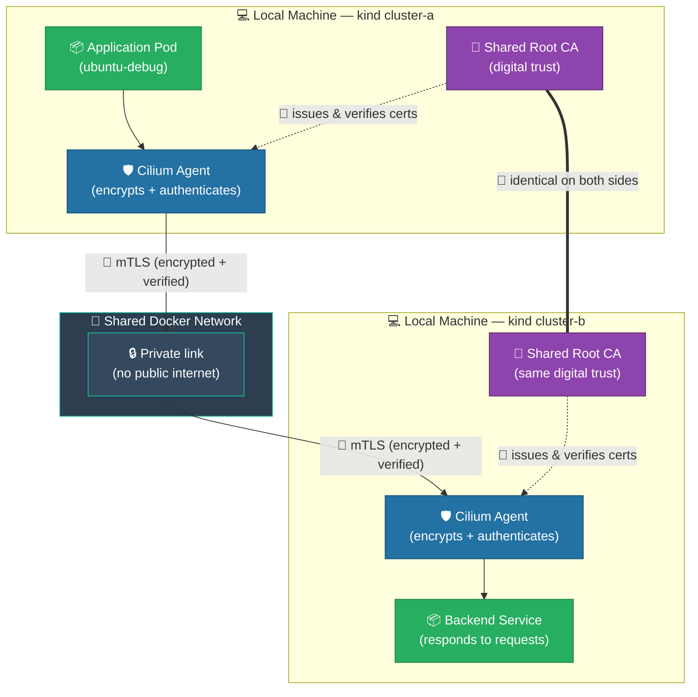
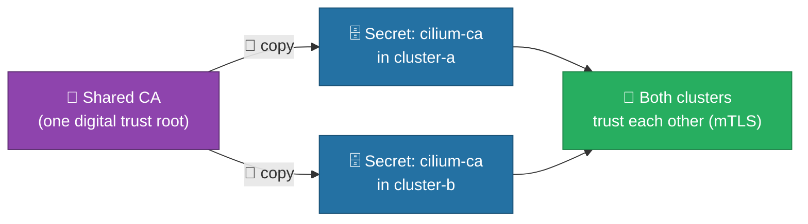
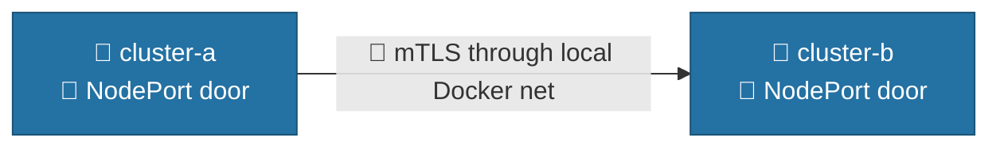
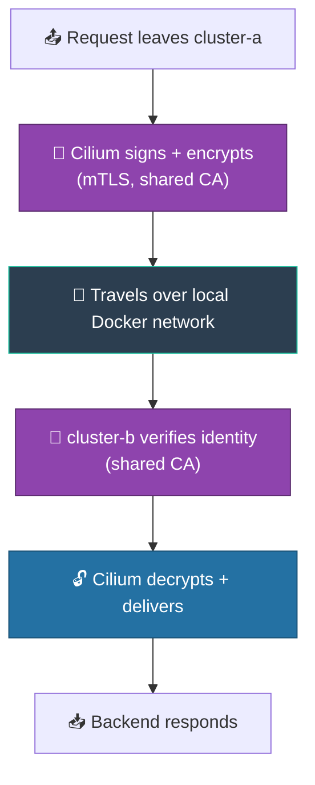

# How to Connect Two Kind Clusters Securely with Cilium ClusterMesh

> **What is this guide?** A plain-language, step-by-step plan to link two separate
> Kubernetes clusters created with **kind** (named `cluster-a` and `cluster-b`) so that
> applications in one cluster can safely talk to applications in the other — as if they
> were one network.
>
> **Why Cilium ClusterMesh?** It connects clusters **without** exposing them to the
> public internet, and it keeps all communication **encrypted** and **mutually verified**
> (each cluster proves who it is to the other).
>
> **The three security promises we keep:**
> 1. 🔐 **Encrypted** — nobody can read the traffic between clusters.
> 2. 🪪 **Mutually authenticated (mTLS)** — each cluster proves its identity using a shared digital certificate authority (CA).
> 3. 🚫 **Private** — the connection point is never published to the public internet.
>
> **About this exercise (kind environment):**
> - Both clusters run **locally on your machine** via `kind`. They share the same Docker
>   network, so they can reach each other directly — no cloud, no VPN, no separate networks.
> - We use **mTLS (shared CA) as the primary security layer**. This authenticates both
>   clusters and encrypts the ClusterMesh control/API traffic.
> - **WireGuard is OPTIONAL** here: because both kind clusters sit on the same trusted
>   local network, mTLS alone already gives a secure, encrypted, authenticated link.
>   Enable WireGuard only if you want an extra encryption layer on the pod data plane.
> - **MetalLB is NOT required.** On kind, the simplest exposure is `NodePort`, which
>   works with zero extra components. MetalLB is only needed if you specifically want a
>   stable LoadBalancer IP (Option B).
>
> **⚡ One-command run:** `./build-clustermesh.sh` builds both clusters, installs Cilium
> with the full feature set, connects the mesh, deploys the global `backend` service, and
> runs the cross-cluster test automatically. The rest of this document is the manual
> walkthrough. File reference: `deploy-backend.yaml` (backend + global Service for
> cluster-b), `deploy-backend-service.yaml` (Service-only for cluster-a),
> `kind-bpf-a.yaml` / `kind-bpf-b.yaml` (cluster definitions), `ubuntu-debug.yaml`
> (manual debug pod — needs pod internet egress).

---

## 🗺️ The Big Picture (Overview Diagram)



**In one sentence:** An app in `cluster-a` asks for `backend`, Cilium encrypts and
signs the request with mTLS, sends it across the local Docker network to `cluster-b`,
where Cilium verifies it and delivers it to the backend — all protected by a shared
digital identity, with no public exposure.

---

## 📋 Project Phases at a Glance

| Phase | What we do | Why it matters |
|-------|-----------|----------------|
| 0 | Install required tools | We need the right software before starting |
| 1 | Create the two kind clusters | Two separate local Kubernetes environments |
| 2 | Create one shared digital identity (CA) | Lets the clusters trust each other (mTLS) |
| 3 | Install Cilium with mTLS on (WireGuard optional) | Builds the secure network layer |
| 4 | Expose the mesh (NodePort — no MetalLB needed) | Make the clusters reachable on the local network |
| 5 | Connect the clusters | Establishes the live secure link |
| 6 | Confirm both sides see each other | Verifies the link is real |
| 7 | Share a service across clusters | Makes an app reachable from the other side |
| 8 | Test the connection | Prove it works end-to-end |
| 9 | Verify encryption & identity | Confirm security promises are met |
| 10 | Resilience check | Confirm it heals after a disconnect |
| 11 | Clean up | Safely remove everything |

---

## 🔧 Phase 0 — Prerequisites (Install the Tools)

Before we begin, install these free, standard tools on your machine:

- 🐳 **kind** — creates local Kubernetes clusters (like a mini cloud on your laptop).
- ☸️ **kubectl** — the remote control for talking to Kubernetes.
- 🛡️ **cilium** CLI — the command-line tool that configures Cilium.
- 🔐 **openssl** — creates digital certificates (our "shared identity").

> ✅ **Check:** Run `kind --version`, `cilium --version`, and `kubectl version --client`. If each prints a version number, you are ready.

---

## 🏗️ Phase 1 — Create the Two Kind Clusters

We create two independent clusters on the same machine. Kind places both on a shared
Docker network, so they can already reach each other by IP — we just need to configure
the secure link.

```bash
kind create cluster --config kind-bpf-a.yaml --name cluster-a
kind create cluster --config kind-bpf-b.yaml --name cluster-b
```

> ✅ **Check:** `kubectl get nodes --context kind-cluster-a` shows all nodes as `Ready`. Do the same for `cluster-b`.

---

## 🪪 Phase 2 — Create the Right Certificates (The Trust Root)

### 🪪 What certificates do we need? (plain language)

Certificates are like **digital ID cards** issued by a **trusted passport office** (the
Certificate Authority, or **CA**). For Cluster Mesh with mTLS you create exactly **one
shared CA** that *both* clusters trust:

| File | What it is | Who creates it | Shared? |
|------|-----------|----------------|--------|
| `ca.crt` | The CA's public ID (the "passport office" certificate) | You, once | ✅ Same on both clusters |
| `ca.key` | The CA's private signing key (keep secret!) | You, once | ✅ Same on both clusters |
| Cluster serving certs | Per-cluster TLS certs for the mesh API | **Cilium generates these automatically** from the shared CA | ❌ Each cluster has its own |

> 🔑 **Key point:** you only create the **CA** (`ca.crt` + `ca.key`). Cilium then
> automatically issues the actual per-cluster certificates from that CA. Because both
> clusters trust the *same* CA, they accept each other's certs → that is **mTLS**.
> If each cluster made its *own* CA, you'd hit the `Cilium CA certificates do not match` error.

**Why a shared CA?** Without this, each cluster would issue its own identity and refuse to trust the other. One shared CA means both clusters speak the same trusted language — this is our **mTLS** foundation and the primary encryption/authentication layer for this exercise.

```bash
# 1. Create the shared "passport office" (one time)
openssl req -x509 -newkey rsa:4096 -nodes \
  -keyout ca.key -out ca.crt -days 3650 -subj "/CN=clustermesh-ca"

# 2. Give the SAME identity to both clusters
kubectl create secret generic cilium-ca -n kube-system \
  --from-file=ca.crt=ca.crt --from-file=ca.key=ca.key --context kind-cluster-a
kubectl create secret generic cilium-ca -n kube-system \
  --from-file=ca.crt=ca.crt --from-file=ca.key=ca.key --context kind-cluster-b

# 3. Tag the secret so Helm (via --ca-secret-name) can adopt it.
#    Without these labels/annotations, `cilium install --ca-secret-name cilium-ca`
#    fails with: "Secret cilium-ca exists ... missing key app.kubernetes.io/managed-by ..."
for ctx in kind-cluster-a kind-cluster-b; do
  kubectl --context "$ctx" -n kube-system label secret cilium-ca \
    app.kubernetes.io/managed-by=Helm --overwrite
  kubectl --context "$ctx" -n kube-system annotate secret cilium-ca \
    meta.helm.sh/release-name=cilium \
    meta.helm.sh/release-namespace=kube-system --overwrite
done
```

### 🛠️ Step2 — Verify the CA looks correct (optional but recommended)

```bash
openssl x509 -in ca.crt -noout -subject -issuer -dates
# Expected: Subject/Issuer both = /CN=clustermesh-ca (self-signed root)
```

### 🛠️ Step3 — Confirm both clusters hold the IDENTICAL CA

```bash
kubectl --context kind-cluster-a -n kube-system get secret cilium-ca -o jsonpath='{.data.ca\.crt}' | base64 -d | openssl x509 -noout -fingerprint
kubectl --context kind-cluster-b -n kube-system get secret cilium-ca -o jsonpath='{.data.ca\.crt}' | base64 -d | openssl x509 -noout -fingerprint
# The two fingerprints MUST match
```

### 🔗 Step4 — Hand the shared CA to Cilium (v1.15+)

> ⚠️ **Cilium v1.15 removed the old flags** `clustermesh.apiserver.tls.ca.cert` and
> `clustermesh.apiserver.tls.ca.key` (deprecated since v1.14). If you pass them you get:
> `execution error at (cilium/templates/validate.yaml:44:5): ... were deprecated in v1.14
> and has been removed in v1.15`.
>
> **The fix:** do **not** pass those flags. Instead, install Cilium with the Helm value
> `--set tls.caSecretName=cilium-ca` (or mount the `cilium-ca` secret yourself). Note that
> the legacy CLI flag `--ca-secret-name` has been removed and now errors with
> `unknown flag: --ca-secret-name`, so use the Helm value form instead. Cilium
> reads the CA from the `cilium-ca` secret you created in Step1, then auto-generates the
> per-cluster serving certificates from this CA, and the clusters mutually authenticate
> over mTLS.
>
> ⚠️ **Helm ownership gotcha:** because you created `cilium-ca` manually (not via Helm),
> `cilium install` with `--set tls.caSecretName=cilium-ca` will refuse to adopt it unless the secret
> carries the Helm ownership labels/annotations. Step1 already tags it with
> `app.kubernetes.io/managed-by=Helm`, `meta.helm.sh/release-name=cilium`, and
> `meta.helm.sh/release-namespace=kube-system` so Helm can import it cleanly.
>
> 🔁 **Alternative fix:** if you don't care about the current contents of `cilium-ca`
> (e.g. it's left over from an old/broken install), just delete it and let the installer
> recreate it, then re-run `cilium install`:
>
> ```bash
> kubectl --context kind-cluster-a -n kube-system delete secret cilium-ca
> kubectl --context kind-cluster-b -n kube-system delete secret cilium-ca
> ```

The Phase 3 install commands below already point Cilium at the shared CA secret — no
deprecated flags are used.



> ⚠️ **Security note:** This shared CA is the foundation of our mTLS. We do **not** use the shortcut flag `--allow-mismatching-ca`, which would blindly trust any identity.

---

## 🛡️ Phase 3 — Install Cilium with mTLS (WireGuard Optional)

Now we install Cilium on both clusters. We tell it to:
- Give each cluster a **unique ID** (so they are not confused).
- Use the **shared CA** from Phase 2 (so they trust each other via mTLS).
- *(Optional)* Turn on **WireGuard encryption** for an extra data-plane encryption layer.
  Because both kind clusters share a trusted local network, WireGuard is **not required**
  for this exercise — mTLS already encrypts and authenticates the mesh traffic.

**Recommended for this exercise (mTLS only, no WireGuard):**

```bash
# Cluster A
cilium install --context kind-cluster-a \
  --set cluster.name=cluster-a \
  --set cluster.id=1 \
  --set tls.caSecretName=cilium-ca

# Cluster B
cilium install --context kind-cluster-b \
  --set cluster.name=cluster-b \
  --set cluster.id=2 \
  --set tls.caSecretName=cilium-ca
```

**If you also want WireGuard (extra encryption on untrusted networks):** add
`--enable-wireguard --wireguard-enabled` to each install command above.

> ✅ **Checks:**
> - `cilium status --context kind-cluster-a --wait` → shows `OK`.
> - `cilium connectivity test --context kind-cluster-a` → all checks pass.
> - If WireGuard was enabled: `cilium config view --context kind-cluster-a | grep -i wireguard` → enabled.

---

## 🌐 Phase 4 — Expose the Mesh (NodePort, No MetalLB Needed)

Because we are on **kind** (local machine, shared Docker network), the simplest and
dependency-free way to make the clusters reachable is **NodePort**. No MetalLB, no
cloud load balancer required.

```bash
cilium clustermesh enable --context kind-cluster-a --service-type NodePort
cilium clustermesh enable --context kind-cluster-b --service-type NodePort
```

> 💡 **MetalLB is optional, not required.** Install MetalLB + use `--service-type LoadBalancer`
> only if you specifically want a stable LoadBalancer IP instead of a random NodePort.
> For this local exercise, NodePort is enough.



---

## 🔗 Phase 5 — Connect the Clusters (Establish the Secure Link)

Now we officially link them. Cilium uses the shared CA to verify identity (mTLS) and
sends traffic across the local network.

```bash
cilium clustermesh connect --context kind-cluster-a --destination-context kind-cluster-b
```

> ⚠️ **If you see "CA certificates do not match":** this means the shared CA from Phase 2
> was not used. Re-apply Phase 2 — do **not** use `--allow-mismatching-ca` as a fix.
>
> ✅ **Check:** `cilium clustermesh status --context kind-cluster-a` → shows `Connected`.

---

## 👀 Phase 6 — Confirm Both Sides See Each Other

```bash
kubectl get ciliumnode --context kind-cluster-a
```

You should see nodes from **both** clusters listed — proof the link is live.

---

## 🌍 Phase 7 — Share a Service Across Clusters

We make a backend application in `cluster-b` available to `cluster-a` by tagging it as a "global service."

> ⚠️ **Critical:** Cilium's global service feature only syncs **endpoints** across clusters —
> it does **not** create the `Service` object on the remote side. You must deploy the
> **identical** `Service` (same name, namespace, ports) in **both** clusters and annotate
> **both** with `service.cilium.io/global=true`. If you only create it in `cluster-b`, the
> `backend` name will not resolve in `cluster-a` (curl fails with "Could not resolve host").
> Do **not** run a backend Deployment in `cluster-a` — only the Service object is needed
> there; Cilium fills its endpoints from the mesh.
>
> 📝 **Annotation key:** use `service.cilium.io/global` (the older `cilium.io/global-service`
> key is deprecated and silently ignored — a global service annotated with the wrong key
> will never be synced across the mesh).

```bash
# 1. The real backend lives in cluster-b (Deployment + Service, already global-annotated)
kubectl apply --context kind-cluster-b -f deploy-backend.yaml
kubectl annotate service backend --context kind-cluster-b "service.cilium.io/global=true" --overwrite

# 2. Create the SAME Service object in cluster-a (no Deployment needed there —
#    use the Service-only manifest so we don't spin up local pods in cluster-a)
kubectl apply --context kind-cluster-a -f deploy-backend-service.yaml
kubectl annotate service backend --context kind-cluster-a "service.cilium.io/global=true" --overwrite
```

> ✅ **Check:** `kubectl get endpoints backend --context kind-cluster-a` now lists the
> `cluster-b` pod IPs (e.g. `10.2.x.x:8080`). This confirms the global service is working.
> (The old `kubectl get ciliumserviceimport` command no longer applies in Cilium 1.19 —
> that CRD was removed; verify via the synced Endpoints instead.)

---

## 🧪 Phase 8 — Test the Connection

Deploy a test pod in `cluster-a` and ask for the backend by its simple name. Use the
prebuilt `curlimages/curl` image so the test does not depend on pod internet egress
(`ubuntu-debug.yaml` installs tools via `apt-get` and needs outbound access).

```bash
kubectl run mesh-test --context kind-cluster-a --image=curlimages/curl:latest \
  --restart=Never --command -- sh -c 'sleep 3600'
kubectl exec --context kind-cluster-a mesh-test -- curl -s --max-time 15 backend:8080
kubectl delete pod mesh-test --context kind-cluster-a --ignore-not-found
```

> ✅ **Expected:** `Hello from Cluster B! 🎉` — the request traveled securely across the mesh.
>
> Other checks: `nslookup backend.default.svc.cluster.local`, and a raw TCP test with `nc`.

---

## 🔍 Phase 9 — Verify Encryption & Identity (Security Audit)

Confirm our three promises are actually delivered:

- 🪪 **mTLS working:** both clusters use the same `cilium-ca` secret (the shared CA from Phase 2). This encrypts + authenticates the mesh control/API traffic.
- 🔐 **WireGuard (if enabled):** `cilium config view --context kind-cluster-a | grep -i wireguard` shows enabled. (Skipped in the mTLS-only variant.)
- 👁️ **Visibility:** `hubble observe --from-pod default/mesh-test` shows the cross-cluster flow.



---

## 💪 Phase 10 — Resilience Check (Does It Heal?)

Prove the connection is real and recoverable:

```bash
# disconnect REQUIRES --destination-context, otherwise it errors:
#   "no destination context specified, use --destination-context to specify which cluster to disconnect from"
cilium clustermesh disconnect --context kind-cluster-a --destination-context kind-cluster-b   # curl (eventually) FAILS
cilium clustermesh connect   --context kind-cluster-a --destination-context kind-cluster-b   # curl works again
```

> 💡 After `disconnect`, in-flight/cached endpoints may still answer for a short grace
> period; give it ~30–60s for the global-service endpoints to be withdrawn before the
> curl fails. Reconnect restores them immediately.

---

## 🧹 Phase 11 — Clean Up

When finished, remove everything safely:

```bash
kubectl delete pod --context kind-cluster-a ubuntu-debug
kubectl delete -f deploy-backend.yaml --context kind-cluster-b 2>/dev/null
kubectl delete -f deploy-backend.yaml --context kind-cluster-a 2>/dev/null
cilium clustermesh disconnect --context kind-cluster-a --destination-context kind-cluster-b 2>/dev/null
cilium clustermesh disable --context kind-cluster-a 2>/dev/null
cilium clustermesh disable --context kind-cluster-b 2>/dev/null
kind get clusters | xargs -I {} kind delete cluster --name {}
```

---

## 📌 Lessons Learned (Troubleshooting Summary)

| Problem | Cause | Correct Fix |
|---------|-------|-------------|
| 🪪 CA certificates do not match | Each cluster made its own identity | Create **one shared CA** (Phase 2); never use `--allow-mismatching-ca` as a real fix |
| 🔌 No LoadBalancer on kind | Local kind has no cloud LB | Use **NodePort** (Phase 4) — no MetalLB needed |
| 🔐 Want extra encryption on untrusted networks | mTLS only covers control plane | Optionally add `--enable-wireguard` at install (Phase 3) |
| 🚫 Connection point exposed publicly | Misconfigured service type | Keep it local (NodePort/ClusterIP); never public |
| ⛔ `clustermesh.apiserver.tls.ca.cert/key` removed in v1.15 | Old deprecated Helm flags passed at install | Use `--set tls.caSecretName=cilium-ca` instead of the removed flags (the `--ca-secret-name` CLI flag was also removed and now errors with `unknown flag`) |
| ⛔ `Secret "cilium-ca" ... cannot be imported ... missing key "app.kubernetes.io/managed-by"` | CA secret created manually without Helm metadata | **Option 1 (adopt):** tag secret with Helm labels/annotations (`managed-by=Helm`, `release-name=cilium`, `release-namespace=kube-system`) before `cilium install`. **Option 2 (recreate):** if you don't need the current secret contents, `kubectl -n kube-system delete secret cilium-ca` on the affected cluster and re-run the install |
| 🚫 `backend` does not resolve in cluster-a (`Could not resolve host`) | Cilium global services only sync **endpoints**, not the `Service` object — the guide only created the Service in cluster-b | Deploy the **identical** `Service` (same name/namespace/ports) in **both** clusters and annotate **both** with `service.cilium.io/global=true`. No Deployment needed in cluster-a; Cilium fills endpoints from the mesh |
| 🚫 Global service silently not synced | Used the deprecated `cilium.io/global-service=true` annotation key | Use the current key `service.cilium.io/global=true` (the old key is ignored by Cilium 1.19) |
| ⛔ `Unable to disconnect clusters: no destination context specified` | `clustermesh disconnect` requires an explicit peer | Use `cilium clustermesh disconnect --context <src> --destination-context <dst>` (matching the `connect` form) |
| ⚠️ `kubectl get ciliumserviceimport` returns "no resource type" | That CRD was removed in Cilium 1.19 | Verify global-service sharing with `kubectl get endpoints backend --context <src>` — it should list the remote cluster's pod IPs |

> **Bottom line for this kind exercise:** Two local clusters, one shared digital identity
> (mTLS), one private local network. Traffic is **encrypted and mutually verified** by
> mTLS — secure by design, with **no MetalLB required** and **WireGuard optional**.
