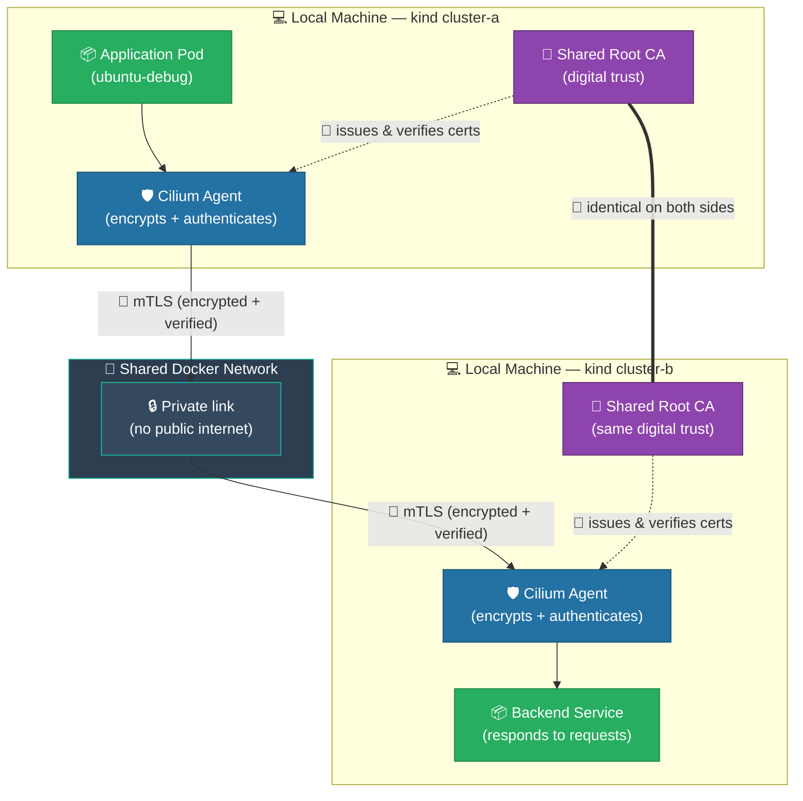
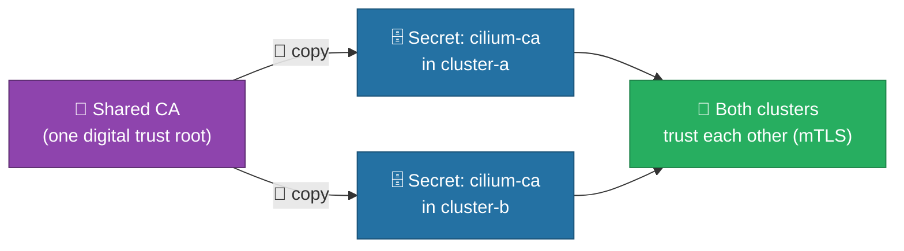
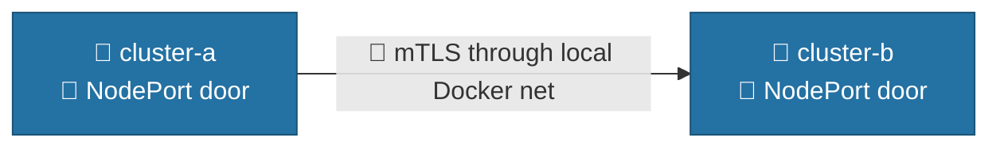
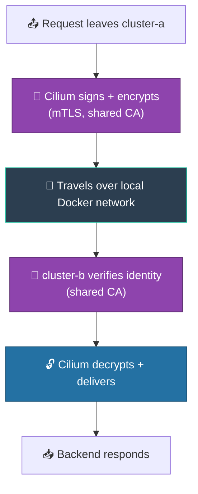

# How to Connect Two Kind Clusters Securely with Cilium ClusterMesh

> **What is this guide?** A plain-language, step-by-step plan to link two separate
> Kubernetes clusters created with **kind** (named `cluster-a` and `cluster-b`) so that
> applications in one cluster can safely talk to applications in the other — as if they
> were one network.
>
> **Why Cilium ClusterMesh?** It connects clusters **without** exposing them to the
> public internet, and it keeps all communication **encrypted** and **mutually verified**
> (each cluster proves who it is to the other).
>
> **The three security promises we keep:**
> 1. 🔐 **Encrypted** — nobody can read the traffic between clusters.
> 2. 🪪 **Mutually authenticated (mTLS)** — each cluster proves its identity using a shared digital certificate authority (CA).
> 3. 🚫 **Private** — the connection point is never published to the public internet.
>
> **About this exercise (kind environment):**
> - Both clusters run **locally on your machine** via `kind`. They share the same Docker
>   network, so they can reach each other directly — no cloud, no VPN, no separate networks.
> - We use **mTLS (shared CA) as the primary security layer**. This authenticates both
>   clusters and encrypts the ClusterMesh control/API traffic.
> - **WireGuard is OPTIONAL** here: because both kind clusters sit on the same trusted
>   local network, mTLS alone already gives a secure, encrypted, authenticated link.
>   Enable WireGuard only if you want an extra encryption layer on the pod data plane.
> - **MetalLB is NOT required.** On kind, the simplest exposure is `NodePort`, which
>   works with zero extra components. MetalLB is only needed if you specifically want a
>   stable LoadBalancer IP (Option B).

---

## 🗺️ The Big Picture (Overview Diagram)



**In one sentence:** An app in `cluster-a` asks for `backend`, Cilium encrypts and
signs the request with mTLS, sends it across the local Docker network to `cluster-b`,
where Cilium verifies it and delivers it to the backend — all protected by a shared
digital identity, with no public exposure.

---

## 📋 Project Phases at a Glance

| Phase | What we do | Why it matters |
|-------|-----------|----------------|
| 0 | Install required tools | We need the right software before starting |
| 1 | Create the two kind clusters | Two separate local Kubernetes environments |
| 2 | Create one shared digital identity (CA) | Lets the clusters trust each other (mTLS) |
| 3 | Install Cilium with mTLS on (WireGuard optional) | Builds the secure network layer |
| 4 | Expose the mesh (NodePort — no MetalLB needed) | Make the clusters reachable on the local network |
| 5 | Connect the clusters | Establishes the live secure link |
| 6 | Confirm both sides see each other | Verifies the link is real |
| 7 | Share a service across clusters | Makes an app reachable from the other side |
| 8 | Test the connection | Prove it works end-to-end |
| 9 | Verify encryption & identity | Confirm security promises are met |
| 10 | Resilience check | Confirm it heals after a disconnect |
| 11 | Clean up | Safely remove everything |

---

## 🔧 Phase 0 — Prerequisites (Install the Tools)

Before we begin, install these free, standard tools on your machine:

- 🐳 **kind** — creates local Kubernetes clusters (like a mini cloud on your laptop).
- ☸️ **kubectl** — the remote control for talking to Kubernetes.
- 🛡️ **cilium** CLI — the command-line tool that configures Cilium.
- 🔐 **openssl** — creates digital certificates (our "shared identity").

> ✅ **Check:** Run `kind --version`, `cilium --version`, and `kubectl version --client`. If each prints a version number, you are ready.

---

## 🏗️ Phase 1 — Create the Two Kind Clusters

We create two independent clusters on the same machine. Kind places both on a shared
Docker network, so they can already reach each other by IP — we just need to configure
the secure link.

```bash
kind create cluster --config kind-bpf-a.yaml --name cluster-a
kind create cluster --config kind-bpf-b.yaml --name cluster-b
```

> ✅ **Check:** `kubectl get nodes --context kind-cluster-a` shows all nodes as `Ready`. Do the same for `cluster-b`.

---

## 🪪 Phase 2 — Create ONE Shared Digital Identity (The Trust Root)

This is the most important security step. We create a single **Certificate Authority (CA)** — like a trusted passport office — and give the *same* one to both clusters.

**Why?** Without this, each cluster would issue its own identity and refuse to trust the other (the "CA certificates do not match" error). One shared CA means both clusters speak the same trusted language — this is our **mTLS** foundation and the primary encryption/authentication layer for this exercise.

```bash
# 1. Create the shared "passport office" (one time)
openssl req -x509 -newkey rsa:4096 -nodes \
  -keyout ca.key -out ca.crt -days 3650 -subj "/CN=clustermesh-ca"

# 2. Give the SAME identity to both clusters
kubectl create secret generic cilium-ca -n kube-system \
  --from-file=ca.crt=ca.crt --from-file=ca.key=ca.key --context kind-cluster-a
kubectl create secret generic cilium-ca -n kube-system \
  --from-file=ca.crt=ca.crt --from-file=ca.key=ca.key --context kind-cluster-b
```



> ⚠️ **Security note:** This shared CA is the foundation of our mTLS. We do **not** use the shortcut flag `--allow-mismatching-ca`, which would blindly trust any identity.

---

## 🛡️ Phase 3 — Install Cilium with mTLS (WireGuard Optional)

Now we install Cilium on both clusters. We tell it to:
- Give each cluster a **unique ID** (so they are not confused).
- Use the **shared CA** from Phase 2 (so they trust each other via mTLS).
- *(Optional)* Turn on **WireGuard encryption** for an extra data-plane encryption layer.
  Because both kind clusters share a trusted local network, WireGuard is **not required**
  for this exercise — mTLS already encrypts and authenticates the mesh traffic.

**Recommended for this exercise (mTLS only, no WireGuard):**

```bash
# Cluster A
cilium install --context kind-cluster-a \
  --cluster-id 1 --cluster-name cluster-a \
  --set clustermesh.apiserver.tls.ca.cert=/var/lib/cilium-ca/ca.crt \
  --set clustermesh.apiserver.tls.ca.key=/var/lib/cilium-ca/ca.key

# Cluster B
cilium install --context kind-cluster-b \
  --cluster-id 2 --cluster-name cluster-b \
  --set clustermesh.apiserver.tls.ca.cert=/var/lib/cilium-ca/ca.crt \
  --set clustermesh.apiserver.tls.ca.key=/var/lib/cilium-ca/ca.key
```

**If you also want WireGuard (extra encryption on untrusted networks):** add
`--enable-wireguard --wireguard-enabled` to each install command above.

> ✅ **Checks:**
> - `cilium status --context kind-cluster-a --wait` → shows `OK`.
> - `cilium connectivity test --context kind-cluster-a` → all checks pass.
> - If WireGuard was enabled: `cilium config view --context kind-cluster-a | grep -i wireguard` → enabled.

---

## 🌐 Phase 4 — Expose the Mesh (NodePort, No MetalLB Needed)

Because we are on **kind** (local machine, shared Docker network), the simplest and
dependency-free way to make the clusters reachable is **NodePort**. No MetalLB, no
cloud load balancer required.

```bash
cilium clustermesh enable --context kind-cluster-a --service-type NodePort
cilium clustermesh enable --context kind-cluster-b --service-type NodePort
```

> 💡 **MetalLB is optional, not required.** Install MetalLB + use `--service-type LoadBalancer`
> only if you specifically want a stable LoadBalancer IP instead of a random NodePort.
> For this local exercise, NodePort is enough.



---

## 🔗 Phase 5 — Connect the Clusters (Establish the Secure Link)

Now we officially link them. Cilium uses the shared CA to verify identity (mTLS) and
sends traffic across the local network.

```bash
cilium clustermesh connect --context kind-cluster-a --destination-context kind-cluster-b
```

> ⚠️ **If you see "CA certificates do not match":** this means the shared CA from Phase 2
> was not used. Re-apply Phase 2 — do **not** use `--allow-mismatching-ca` as a fix.
>
> ✅ **Check:** `cilium clustermesh status --context kind-cluster-a` → shows `Connected`.

---

## 👀 Phase 6 — Confirm Both Sides See Each Other

```bash
kubectl get ciliumnode --context kind-cluster-a
```

You should see nodes from **both** clusters listed — proof the link is live.

---

## 🌍 Phase 7 — Share a Service Across Clusters

We make a backend application in `cluster-b` available to `cluster-a` by tagging it as a "global service."

```bash
kubectl apply --context kind-cluster-b -f deploy-backend.yaml
kubectl annotate service backend --context kind-cluster-b "cilium.io/global-service=true"
```

> ✅ **Check:** `kubectl get ciliumserviceimport --context kind-cluster-a -A` shows the imported service.

---

## 🧪 Phase 8 — Test the Connection

Deploy a test pod in `cluster-a` and ask for the backend by its simple name.

```bash
kubectl apply --context kind-cluster-a -f ubuntu-debug.yaml
kubectl exec --context kind-cluster-a -it ubuntu-debug -- curl backend:8080
```

> ✅ **Expected:** `Hello from Cluster B! 🎉` — the request traveled securely across the mesh.
>
> Other checks: `nslookup backend.default.svc.cluster.local`, and a raw TCP test with `nc`.

---

## 🔍 Phase 9 — Verify Encryption & Identity (Security Audit)

Confirm our three promises are actually delivered:

- 🪪 **mTLS working:** both clusters use the same `cilium-ca` secret (the shared CA from Phase 2). This encrypts + authenticates the mesh control/API traffic.
- 🔐 **WireGuard (if enabled):** `cilium config view --context kind-cluster-a | grep -i wireguard` shows enabled. (Skipped in the mTLS-only variant.)
- 👁️ **Visibility:** `hubble observe --from-pod default/ubuntu-debug` shows the cross-cluster flow.



---

## 💪 Phase 10 — Resilience Check (Does It Heal?)

Prove the connection is real and recoverable:

```bash
cilium clustermesh disconnect --context kind-cluster-a   # curl now FAILS
cilium clustermesh connect   --context kind-cluster-a --destination-context kind-cluster-b  # curl works again
```

---

## 🧹 Phase 11 — Clean Up

When finished, remove everything safely:

```bash
kubectl delete pod --context kind-cluster-a ubuntu-debug
kubectl delete -f deploy-backend.yaml --context kind-cluster-b 2>/dev/null
cilium clustermesh disconnect --context kind-cluster-a 2>/dev/null
cilium clustermesh disable --context kind-cluster-a 2>/dev/null
cilium clustermesh disable --context kind-cluster-b 2>/dev/null
kind get clusters | xargs -I {} kind delete cluster --name {}
```

---

## 📌 Lessons Learned (Troubleshooting Summary)

| Problem | Cause | Correct Fix |
|---------|-------|-------------|
| 🪪 CA certificates do not match | Each cluster made its own identity | Create **one shared CA** (Phase 2); never use `--allow-mismatching-ca` as a real fix |
| 🔌 No LoadBalancer on kind | Local kind has no cloud LB | Use **NodePort** (Phase 4) — no MetalLB needed |
| 🔐 Want extra encryption on untrusted networks | mTLS only covers control plane | Optionally add `--enable-wireguard` at install (Phase 3) |
| 🚫 Connection point exposed publicly | Misconfigured service type | Keep it local (NodePort/ClusterIP); never public |

> **Bottom line for this kind exercise:** Two local clusters, one shared digital identity
> (mTLS), one private local network. Traffic is **encrypted and mutually verified** by
> mTLS — secure by design, with **no MetalLB required** and **WireGuard optional**.
